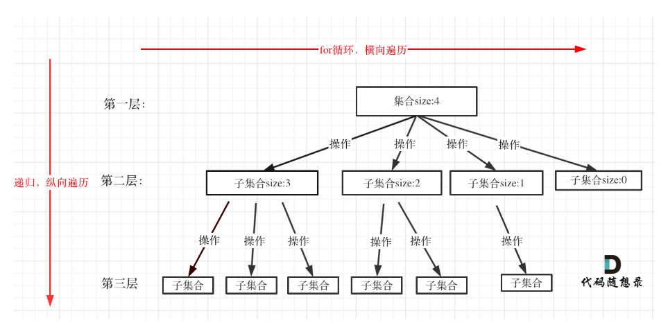

:PROPERTIES:
:ID:       3c0f22b4-1dd8-433c-aec4-13eda95dffea
:END:
#+title: Backtracking
#+filetags: Algorithm

* 简述
回溯算法类似枚举思想，穷举所有路径，例如：深度优先遍历

* 适合解决的问题
- 组合问题：N 个数里面按一定规则找出 k 个数的集合
  - [[https://leetcode.com/problems/combinations/description/][LT77]]
  - [[https://leetcode.com/problems/combination-sum-ii/description/https://leetcode.com/problems/combination-sum-ii/description/][*LT40*]] 去重问题，需回看
- 切割问题：一个字符串按一定规则有几种切割方式
- 子集问题：一个 N 个数的集合里有多少符合条件的子集
- 排列问题：N 个数按一定规则全排列，有几种排列方式
- 棋盘问题：N 皇后，解数独等等

** 经典案例
数独、八皇后、0-1背包问题、图的着色、旅行商问题、全排列，正则表达式等

* 如何理解回溯算法
- 回溯法解决的问题都可以抽象为 *树形结构*
- 回溯法解决的都是在集合中递归查找子集
  - 集合的大小就构成了树的宽度
  - 递归的深度构成了树的深度
  - 递归就要有终止条件，所以必然是一棵高度有限的树（N叉树）

* 回溯函数模板
#+DOWNLOADED: screenshot @ 2023-10-24 15:41:20

#+begin_src cpp
  void backtracking(...) {
    if (终止条件) {
      // 存放结果
      return;
    }
    for (选择：本层集合中元素（树中节点孩子的数量就是集合的大小）) {
      处理节点;
      backtracking(路径，选择列表); // 递归
      回溯，撤销本次处理结果;
    };
  }
#+end_src

* 优化
- 剪枝
- 重复子问题：缓存子问题结果，避免重复计算

* 去重套路 *Important*
1. 先对输入进行排序
2. 使用 ~used~ 数组
   - ~used[i-1]==true~ 说明同一树枝 ~candidates[i-1]~ 使用过
   - ~used[i-1]==false~ 说明同一树层 ~candidates[i-1]~ 使用过
