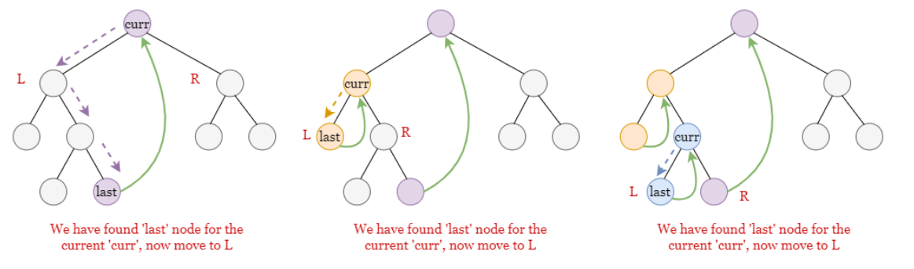
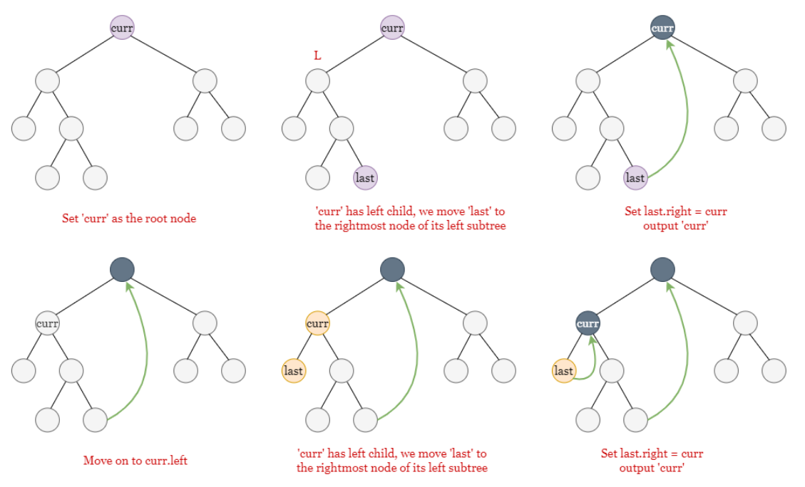

:PROPERTIES:
:ID:       9e22e9d1-2beb-4e17-9d2d-6a747af51ae3
:END:
#+title: Preorder Traversal
#+filetags: Algorithm

- [[https://leetcode.com/problems/binary-tree-preorder-traversal/][LeetCode 144]]

* Approach1: Recursion
* Approach2: Iteration
#+begin_src python
  class Solution:
      def preorderTraversal(self, root: TreeNode) -> List[int]:
          answer = []
          stack = [root]

          # Note that we add curr_node's right child to the stack first.
          while stack:
              curr_node = stack.pop()
              if curr_node:
                  answer.append(curr_node.val)
                  stack.append(curr_node.right)
                  stack.append(curr_node.left)

          return answer
#+end_src

* Morris Traversal                                                :Algorithm:
:PROPERTIES:
:ID:       60aec15c-8186-4888-b84d-abef37f01d8b
:END:

- O(n) time complexity
- *O(1)* space complexity
- 思路：处理完左子树的最后一个节点，需要跳到当前节点，就能继续处理右节点
  - 原先使用栈实现跳转
  - 需要修改原树

- Idea:
#+DOWNLOADED: screenshot @ 2023-10-11 15:18:10

- Example:
#+DOWNLOADED: screenshot @ 2023-10-11 15:20:45

#+begin_src python
  class Solution:
      def preorderTraversal(self, root: Optional[TreeNode]) -> List[int]:
          answer = []
          curr = root

          while curr:
              if not curr.left:
                  # If there is no left child, go for the right child.
                  answer.append(curr.val)
                  curr = curr.right
              else:
                  # find the last node in the left subtree.
                  last = curr.left
                  # last is the rightmost node in the left subtree.
                  while last.right and last.right != curr:
                      last = last.right

                  if not last.right:
                      # last node is not modified yet.

                      # add the current node to the answer.
                      answer.append(curr.val)
                      # connect the last node with 'curr' node.
                      last.right = curr
                      # move into the left subtree.
                      curr = curr.left
                  else:
                      # last.right is equal to curr node.
                      # We have visited the left subtree.
                      last.right = None
                      curr = curr.right
          return answer
#+end_src
