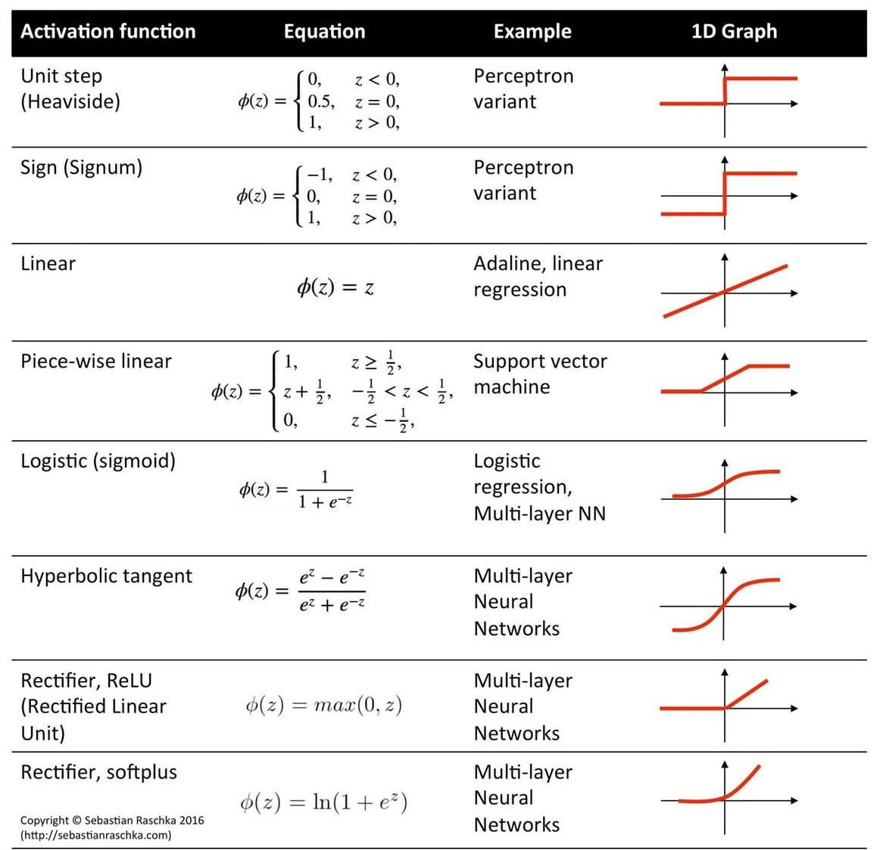

:PROPERTIES:
:ID:       bbe0d8aa-27a7-4833-9d54-1fa917b96c2d
:END:
#+title: Activation Functions
#+filetags: ML

* Overview

* Sigmoid
[[../assets/ML/SigmoidFunction.png]]

* ReLU
Rectified Linear Unit
- $g(z)=max(0, z)$
[[../assets/ML/ReLUFunction.png]]

* Linear Activation Function
- "No activation function"
- If all nodes uses linear activation function, then it's equivalent to linear regression.
[[../assets/ML/LinearActivationFunction.png]]

* Choosing for Output Layer
- Binary Classification: Sigmoid
- Regression(Non-negative Output): ReLU
- Regression: Linear Activation Function

* Choosing for Hidden Layer
- RelU is by far the most common choice.
  - faster to compute ~max(0, z)~
  - flat only in one part, gradient descent would be faster than sigmoid (flat in two places)
    - \(\frac{\partial}{\partial w}J(\bm{W}, \bm{B})\approx 0\) when g(z) is flat
