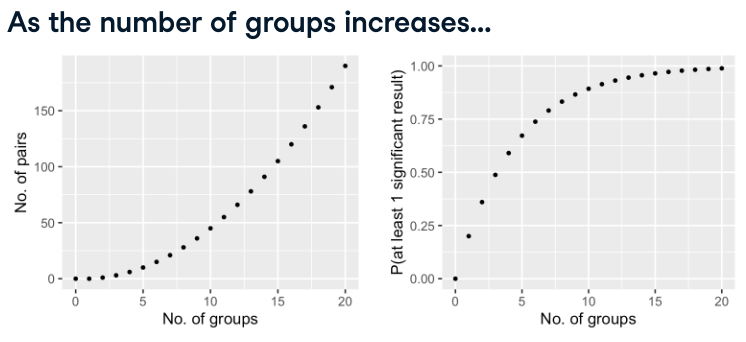

:PROPERTIES:
:ID:       802be368-002c-4591-b6a9-3f14c71f0467
:END:
#+title: ANOVA
#+filetags: :Python:Statistics:

* Overview
- ANOVA(Analysis of variance)
  - is a statistical test used to analyze the difference between the means of more than two groups.
- \(p_{value}<\alpha\) means that at least two of the categories have significant differences.
  - But it doesn't tell us which two categories they are.
  - Need to conduct all pair tests to identify. ~pingouin.pairwise_tests~

* Number of Groups Issue

- with 20 groups, it's almost guaranteed that we'll get at least one false positive.
  - Solution: apply adjustment to increase the p-values reducing the chance of getting a false positive.
    - Bonferroni correction: ~pingouin.pairwise_tests(..., padjust='bonf')~
    - [[https://pingouin-stats.org/build/html/generated/pingouin.pairwise_tests.html][More methods of correction]]
    - Almost all pairwise t-testing situations choosing a correction is more appropriate.

* Example
** [[id:ffde831f-5883-4dd5-b406-caa135d0e53b][pingouin]]
