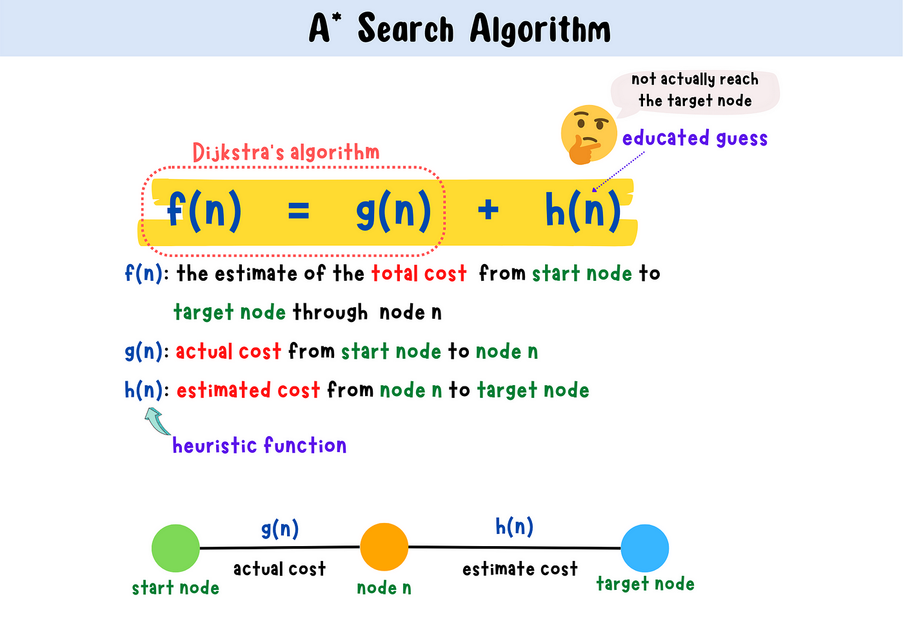
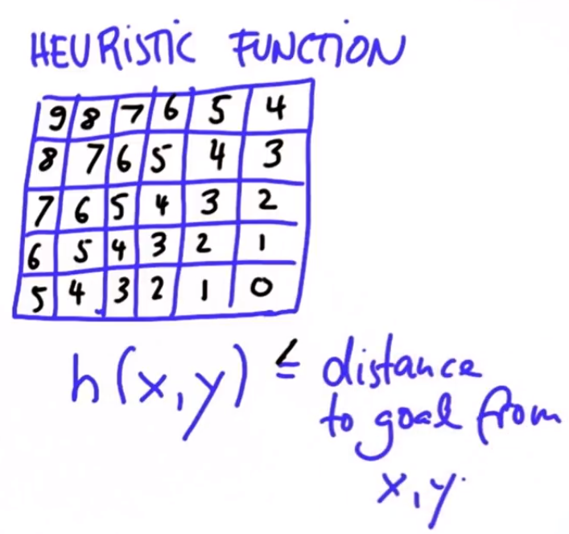

:PROPERTIES:
:ID:       2b951be4-acf8-4778-97e4-111695cb414e
:END:
#+title: A* Search
#+filetags: :Algorithm:

* A* Search
A* search is a best-first search algorithm. It is an extension of Dijkstra's
shortest path algorithm. It's often used for path finding in combinatorial search.

** Heuristic Function

#+DOWNLOADED: screenshot @ 2024-01-17 10:34:45

* Implementation

#+DOWNLOADED: screenshot @ 2023-10-28 12:09:53
[[file:images/A*_Search/2023-10-28_12-09-53_screenshot.png]]
