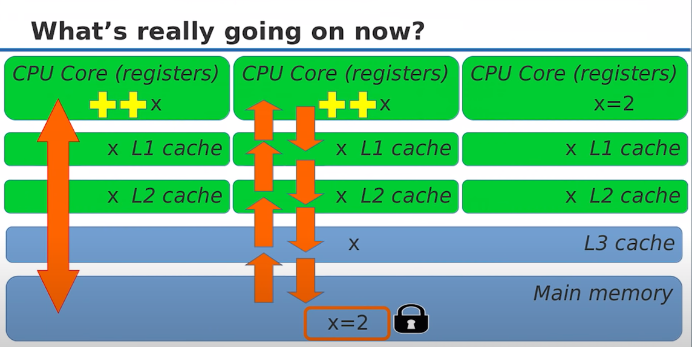
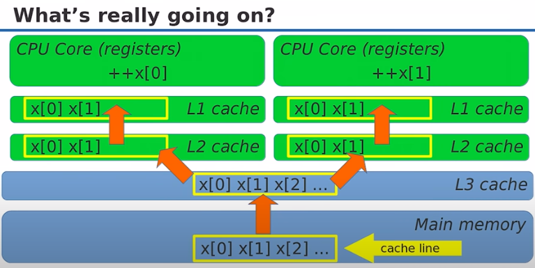

:PROPERTIES:
:ID:       9fb084bb-ba72-4136-8e91-60f0b7ba216f
:END:
#+title: Atomics
#+filetags: C++

* Atomic Operation
Atomic operation is guaranteed to execute as a single transaction:
- At the low level, atomic operations are *special hardware instructions*. (hardware guarantees at)

** Overview
#+begin_src c++
#include <atomic>
std::atomic<int> x{0};
// multi-thread ++x operation;
#+end_src

#+DOWNLOADED: screenshot @ 2024-02-22 19:40:49

** Atomic Operations
- Atomic: ~++x~, ~x++~, ~x += 1~, ~x |= 2~, ~int y = x * 2~, ~x = y + 1~
- Not atomic: ~x *= 2~, ~x = x + 1~, ~x = x * 2~
  - ~x *= 2~ does not compile
  - ~x = x + 1~ two separate atomic operations

** What types can be made atomic?
- Any _trivially copyable_ type
  - Continuous chunk of memory
  - Copying the object means copying all bits (memcpy)
  - No virtual functions, noexcept constructor

** ~std::atomic<T>~ Operations
- Assignment and copy (read and write) for all types
- Increment and decrement for raw pointers
- ~++, +=(fetch_add), --, -= , |=, &=, ^==~ for integers
- Explicit reads and writes: ~T y = x.load()~, ~x.store(y)~
- Atomic exchange: ~T z = x.exchange(y) // Atomically: z=x; x=y;~
- *Compare-and-swap (conditional exchange)*
*** Compare-and-swap (CAS)
:PROPERTIES:
:ID:       5b145d8a-330f-4b7a-a1a3-9fa8ebb3564d
:END:
#+begin_src c++
bool success = x.compare_exchange_strong(expected, desired);
// if x == expected, make x = desired and return true
// Otherwise, set expected = x and return false
#+end_src

- Atomic increment with CAS
#+begin_src c++
std::atomic<int> x{0};
int x0 = x;
while (!x.compare_exchange_strong(x0 /* pass by reference */, x0 + 1)) {}
// If return false, x0 will be updated to the current value of x
// otherwise, x will be updated to x0 + 1
#+end_src
- CAS can be used to increment doubles, multiply integers, ...
*** ~compare_exchange_weak~
- The reason to use weak: *read is faster than write*
#+begin_src c++
success = x.compare_exchange_weak(expected, desired);
// Same thing but can "spuriously fail" and return false even if x == expected
// If you can't get the answer from the other core in some timeout, you just return false.
#+end_src
- pseudo-code
#+begin_src c++
bool compare_exchange_strong(T& expected, T desired) {
    Lock L; // get exclusive access
    T tmp = value; // current value of the atomic (read)
    if (tmp != expected) { expected = tmp; return false; }
    value = desired;
    return true;
}

bool compare_exchange_weak(T& expected, T desired) {
    T tmp = value; // current value of the atomic
    if (tmp != expected) { expected = tmp; return false; }
    TimedLock L; // get exclusive access or fail
    if (!L.locked()) return false;
    tmp = value; // value could have changed!
    if (tmp != expected) { expected = tmp; return false; }
    value = desired;
    return true;
}
#+end_src
- The idea: *Exclusive write* on particular platform might be hard to get, *but the read isn't*.
- Similar to singleton ~get_instance~ double-check pattern.
- A read before lock is really fast.

** Is atomic lock-free?
| std::atomic<T> Type T               | run-time is_lock_free() |
|-------------------------------------+-------------------------|
| ~struct A {long x;}~                | Yes                     |
| ~struct B {long x; long y;}~        | Yes on x86              |
| ~struct C {long x; int y;}~         | Yes on x86              |
| ~struct D {int x; int y; int z;}~   | No. 12 bytes -padding   |
| ~struct E {long x; long y; long z}~ | No. >16 bytes           |
- Why not compile-time for ~is_lock_free~ method? - alignment or padding
  - Struct B will only be atomic if it has 16-byte alignment on x86
- C++17 adds constexpr ~is_always_lock_free()~

** Other Performance Issues
*** Cache Line
- Atomic operations have to wait for cache line access.
#+begin_src c++
std::atomic<int> x[2];
++x[0]; // in Thread 1
++x[1]; // in Thread 2
#+end_src
#+DOWNLOADED: screenshot @ 2024-02-23 08:32:44

Things to know about cache line:
- It's the price of data sharing without races
- Accessing different locations in the same cache line still incurs run-time penalty (false sharing)
- Avoid false sharing by aligning per-thread data to separate cache lines
  - On NUMA machines, may be even separate pages

* Atomic Variables
- *Atomic variables are rarely used by themselves*
- The fact is that the *atomic variable is an _index_ to (non-atomic) memory*.

* [[id:c0942ec7-3b9f-4292-bad3-43f88f026881][Lock-free]]
* References
- [[https://www.youtube.com/watch?v=ZQFzMfHIxng][cppcon 2017]]
