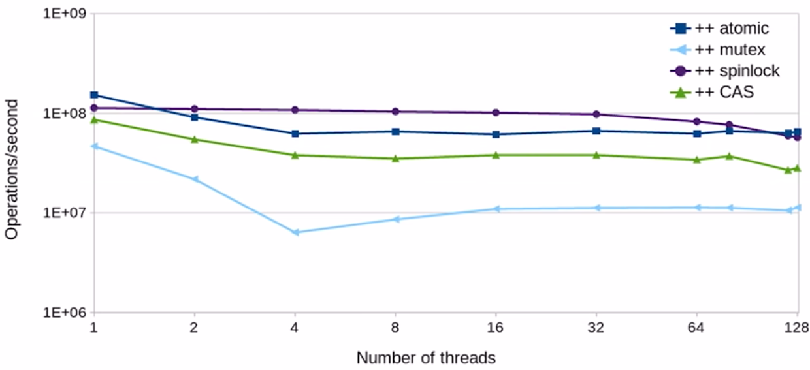

:PROPERTIES:
:ID:       9fb084bb-ba72-4136-8e91-60f0b7ba216f
:END:
#+title: Atomics
#+filetags: C++

* Atomic Operation
Atomic operation is guaranteed to execute as a single transaction:
- At the low level, atomic operations are *special hardware instructions*. (hardware guarantees at)

** Overview
#+begin_src c++
#include <atomic>
std::atomic<int> x{0};
// multi-thread ++x operation;
#+end_src

#+DOWNLOADED: screenshot @ 2024-02-22 19:40:49
[[file:images/Overview/2024-02-22_19-40-49_screenshot.png]]

** Atomic Operations
- Atomic: ~++x~, ~x++~, ~x += 1~, ~x |= 2~, ~int y = x * 2~, ~x = y + 1~
- Not atomic: ~x *= 2~, ~x = x + 1~, ~x = x * 2~
  - ~x *= 2~ does not compile
  - ~x = x + 1~ two separate atomic operations

** What types can be made atomic?
- Any _trivially copyable_ type
  - Continuous chunk of memory
  - Copying the object means copying all bits (memcpy)
  - No virtual functions, noexcept constructor

** ~std::atomic<T>~ Operations
- Assignment and copy (read and write) for all types
- Increment and decrement for raw pointers
- ~++, +=(fetch_add), --, -= , |=, &=, ^==~ for integers
- Explicit reads and writes: ~T y = x.load()~, ~x.store(y)~
- Atomic exchange: ~T z = x.exchange(y) // Atomically: z=x; x=y;~
- *Compare-and-swap (conditional exchange)*

*** Compare-and-swap (CAS)
:PROPERTIES:
:ID:       5b145d8a-330f-4b7a-a1a3-9fa8ebb3564d
:END:
#+begin_src c++
bool success = x.compare_exchange_strong(expected, desired);
// if x == expected, make x = desired and return true
// Otherwise, set expected = x and return false
#+end_src
- Atomic increment with CAS
#+begin_src c++
std::atomic<int> x{0};
int x0 = x;
while (!x.compare_exchange_weak(x0, x0 + 1)) {}
#+end_src
- CAS can be used to increment doubles, multiply integers, ...

** Is atomic lock-free?
| std::atomic<T> Type T               | run-time is_lock_free() |
|-------------------------------------+-------------------------|
| ~struct A {long x;}~                | Yes                     |
| ~struct B {long x; long y;}~        | Yes on x86              |
| ~struct C {long x; int y;}~         | Yes on x86              |
| ~struct D {int x; int y; int z;}~   | No. 12 bytes -padding   |
| ~struct E {long x; long y; long z}~ | No. >16 bytes           |
- Why not compile-time for ~is_lock_free~ method? - alignment or padding
  - Struct B will only be atomic if it has 16-byte alignment on x86
- C++17 adds constexpr ~is_always_lock_free()~

* Increment Operation Performance
#+DOWNLOADED: screenshot @ 2024-02-22 22:09:36

