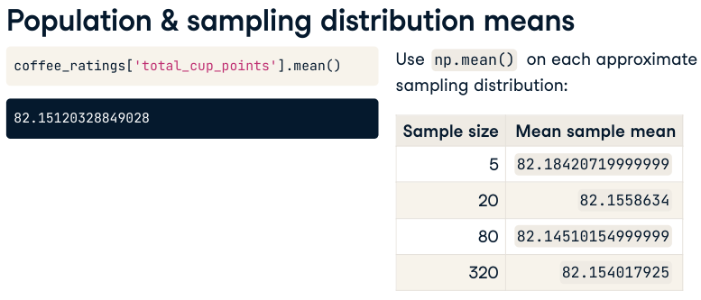
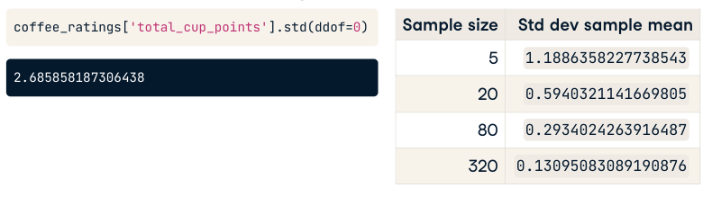
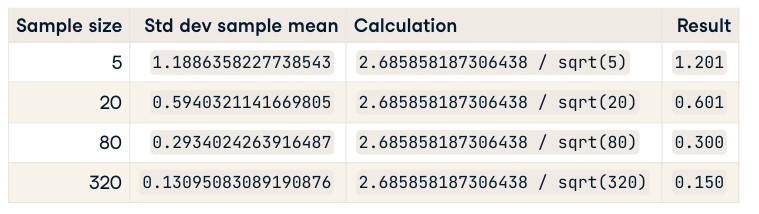

:PROPERTIES:
:ID:       193270c8-6738-48fb-b728-8462f10de3c5
:END:
#+title: Central Limit Theorem
#+filetags: :Statistics:Math:

* Definition
The Distribution of sample means is normal distribution.
- $SE=\frac{\sigma}{\sqrt{n}}$ the std of sample means

** Example
- Mean of sample means

- Std of sample means

- SE(Std of sample means) = \(\frac{\sigma}{\sqrt{n}}\)

* Python Examples
#+begin_src python
die = pd.Series([1, 2, 3, 4, 5, 6])

# 200 samples of 10 dice rolls
sample_means = []
sample_stds = []
for i in range(200):
    sample = die.sample(10, replace=True)
    sample_means.append(sample.mean())
    sample_stds.append(sample.std())

# Plot the sample means/std
plt.hist(sample_means)
plt.show()
#+end_src
