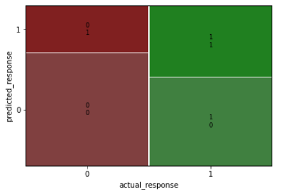
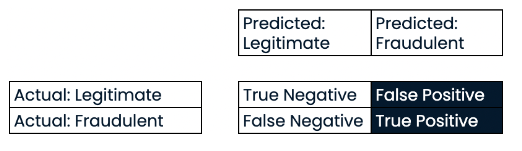
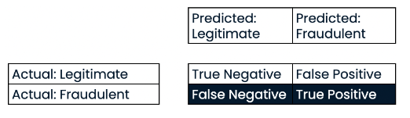
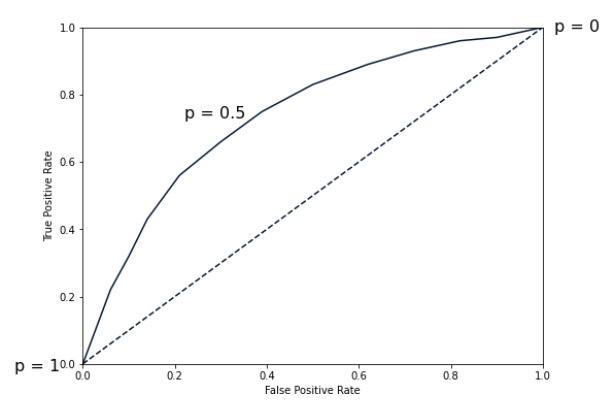
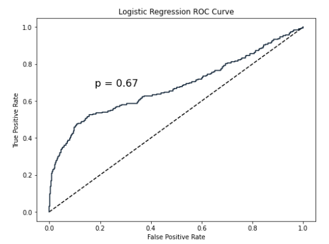

:PROPERTIES:
:ID:       91a5b0fd-48cd-47aa-8fff-cb9cb0fd520c
:END:
#+title: Classification Metrics
#+filetags: :ML:
* Confusion Matrix
|              | predicted false | predicted true |
| actual false | correct         | false positive |
| actual true  | false negative  | correct        |
- Confusion matrix: the counts of each outcome
#+begin_src python
# manually calculate the confusion matrix
actual_response = churn['has_churned']
predicted_response = np.round(model.predict()) # predict() returns each observation's probability
outcomes = pd.DataFrame({'actual': actual_response, 'predicted': predicted_response})
print(outcomes.value_counts(sort=False))

# automatically calculate the confusion matrix
conf_matrix = model.pred_table()
# => array([[TN, FP],
#           [FN, TP]])
# TN = conf_matrix[0, 0]
# FP = conf_matrix[0, 1]
#+end_src

- Plotting Confusion Matrix
#+begin_src python
from statsmodels.graphics.mosaicplot import mosaic
mosaic(conf_matrix)
#+end_src

** Metrics
- *Accuracy* is the proportion of correct predictions.

\[accuracy=\frac{TN+TP}{TN+FN+FP+TP}\]

- *Specificity* is the proportion of true negatives.

\[specificity=\frac{TN}{TN+FP}\]

- There is often a *trade-off* between sensitivity and specificity.

** Metrics For Class Imbalance
- For example: predicting fraudulent bank transactions
  - 99% of transactions are legitimate

- *Precision*: \(\frac{TP}{TP+FP}\)

- *Recall* or *Sensitivity* \(\frac{TP}{TP+FN}\)
  - *High Recall* means: Predicted most fraudulent transactions correctly.

- *F1 score*: \(2\times\frac{precision\times recall}{precision+recall}\)
  - Used when we seeking a model performs well across both precision and recall.
  - Gives *equal weight* to precision and recall.

** scikit-learn Example
#+begin_src python
from sklearn.metrics import classification_report, confusion_matrix
from sklearn.model_selection import train_test_split

knn = KNeighborsClassifier(n_neighbors=5)
X_train, X_test, y_train, y_test = train_test_split(X, y, test_size=0.2)
knn.fit(X_train, y_train)
y_pred = knn.predict(X_test)

print(confusion_matrix(y_test, y_pred))
# report shows precision, recall, f1-score, support
print(classification_report(y_test, y_pred)
#+end_src

* Metrics for Binary Classification(Imbalanced)
** ROC Curve
- Use ROC(receiver operating characteristic) curve
  - to visualize how different thresholds affect true positive and false positive rates

- Dotted line represents a simple model which randomly guesses labels.
- *TPR* (true positive rate): recall or sensitivity
- *FPR* (false positive rate): =FP/(FP+TN)=
- \(p=0\) means the model:
  - correctly predict all positive values
  - incorrectly predict all negative values
- Each point on the ROC curve represents a TPR/FPR pair corresponding
  to *a particular decision threshold*.
#+begin_src python
from sklearn.metrics import roc_curve
y_pred_prob = logreg.predict_proba(X_test)[:, 1]
fpr, tpr, thresholds = roc_curve(y_test, y_pred_probs)
plt.plot([0, 1], [0, 1], linestyle='k--')
plt.plot(fpr, tpr)
plt.xlabel('False Positive Rate')
plt.ylabel('True Positive Rate')
plt.show()
#+end_src

- ROC curve helps in *selecting the optimal threshold* for classification

** Quantified Metric: ROC AUC
A single scalar value that summarizes the performance of the classifier across all thresholds.
- represents the area under the ROC curve
- range from 0 to 1
  - 1: Perfect model
  - 0.5: Model with no discrimination power, equivalent to random guessing.
  - 0.7~0.8: acceptable
  - 0.8~0.9: excellent
  - 0.9~: outstanding
#+begin_src python
from sklearn.metrics import roc_auc_score
print(roc_auc_score(y_test, y_pred_probs))
#+end_src
