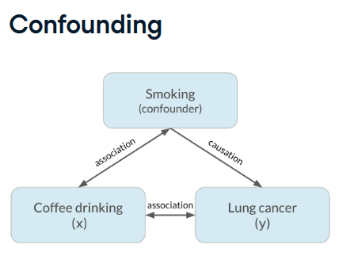
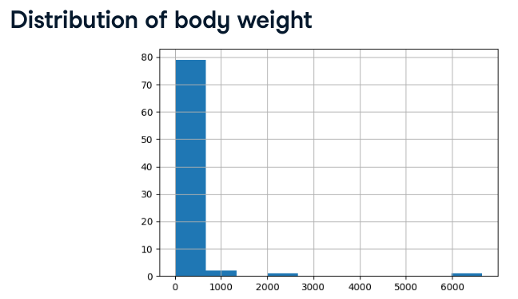
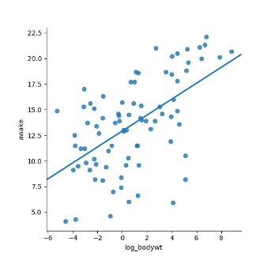
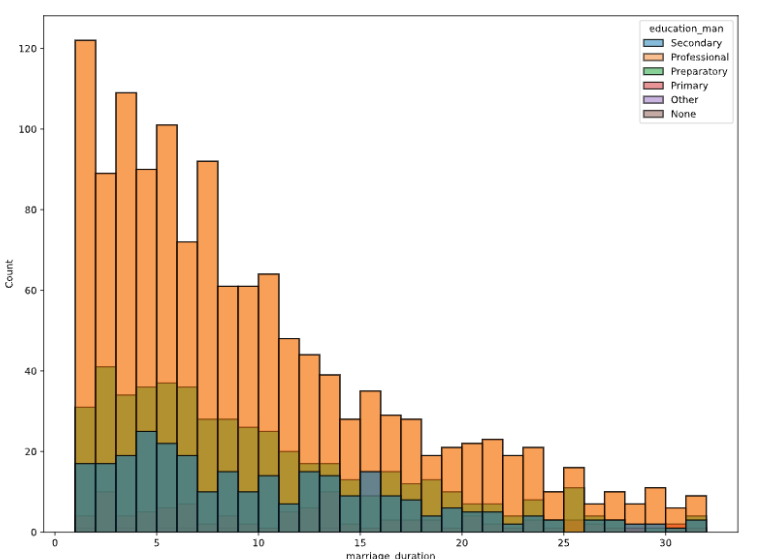
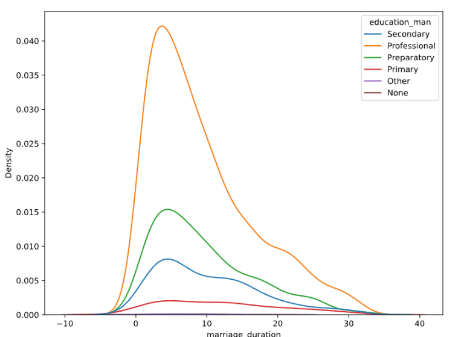
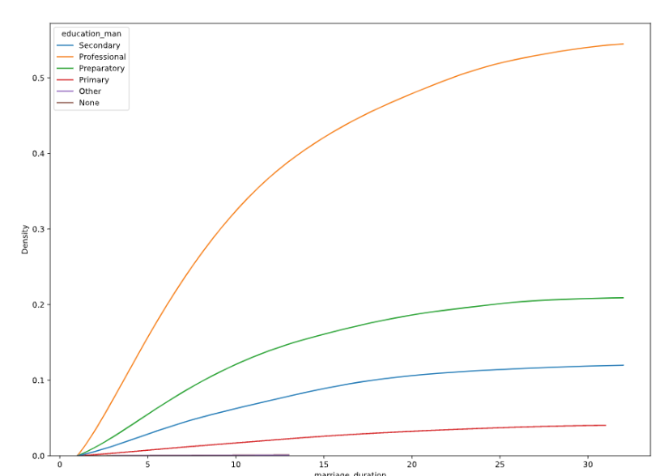
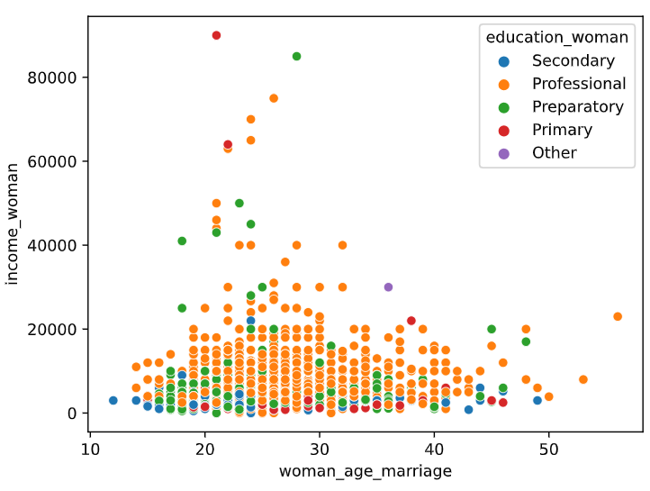

:PROPERTIES:
:ID:       b80406e2-60b3-4607-9dc2-6791405020cc
:END:
#+title: Correlation
#+filetags: :Statistics:Math:

* Correlation Coefficient
- Quantifies the *linear relationship* between two variables
- Number between -1 and 1
- Magnitude corresponds to strength of relationship
- Sign (+ or -) corresponds to direction of relationship
- *Correlation shouldn't be used blindly*; Always visualize the data
- *Correlation does not imply causation*

** Confounding Phenomenon

- Note that =coffee drinking= doesn't cause =lung cancer=, but the =smoking= does.
- The =smoking= variable is called a confounder, or lurking variable.
- The relationship between =coffee= and =lung cancer= is a spurious correlation.

* Calculating Correlations
** Pearson Product-moment Correlation (r)
\[r=\sum_{i=1}^{n}\frac{(x_{i}-\bar{x})(y_{i}-\bar{y})}{\sigma_{x}\times\sigma_{y}}\]
- Most common
- Some variations on this formula:

*** Kendall's Tau
*** Spearman's Rho

** Non-linear Relationship
Using transformer to make relationship linear
- Log transformation(~log(x)~)
- Square root transformation(~sqrt(x)~)
- Reciprocal transformation(~1 / x~)
- Combinations of transformation
  - ~log(x)~ and ~log(y)~
  - ~sqrt(x)~ and ~1 / y~

*** Log Transformation Example
High Skewed Relationship

- Using log transformation
#+begin_src python
msleep['log_bodywt'] = np.log(msleep['bodywt'])

sns.lmplot(x='log_bodywt', y='awake', data=msleep, ci=None)
plt.show()
#+end_src

* Categorical Relationships
- ~sns.histplot(data=df, x='date', y='value', hue='category')~: explore relationships

- Relationship isn't clear
** KDE Plots
- ~sns.kdeplot(data=df, x='date', y='value', hue='category')~
- ~kdeplot~ uses smoothing algorithm, can use option ~cut=0~ to trim nonsense curves

  - Cumulative KDE plots
    - ~sns.kdeplot(data=df, x='date', y='value', hue='category', cut=0, cumulative=True)~

** Scatter Plots
  - ~sns.scatterplot(data=divorce, x='woman_age_marriage', y='income_woman', hue='education_woman')~

* Python Examples
** Calculating Correlation
- Pearson Correlation:
  - Quick way to see pairwise correlation: ~df.corr()~
    - ~sns.heatmap(df.corr, annot=True)~: pairwise correlation overview
    - ~sns.pairplot(data=df, vars=['spy', 'appl', 'nvda'])~: pairwise correlation details
  - ~s1.corr(s2)~

** Visualizing Relationships
#+begin_src python
import seaborn as sns

sns.scatterplot(x='sleep_total', y='sleep_rem', data=msleep)
plt.show()

# Adding a trendline with confidence interval off
sns.lmplot(x='sleep_total', y='sleep_rem', data=msleep, ci=None)
#+end_src
