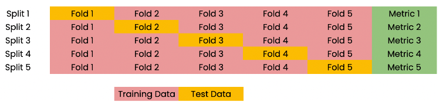
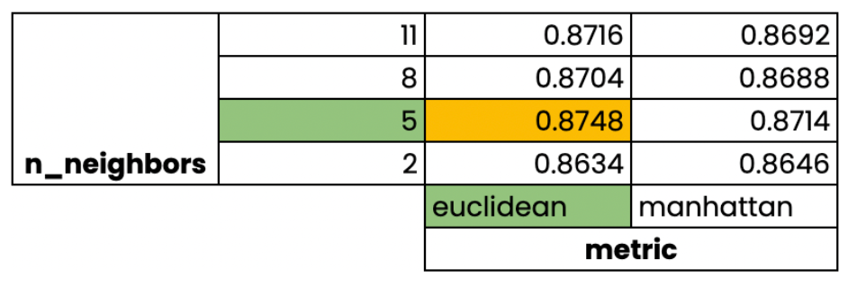

:PROPERTIES:
:ID:       5461b659-bc1a-4594-b7fb-8388345187d3
:END:
#+title: Cross-validation
#+filetags: :Python:ML:

* Problem
- Model performance (e.g. R-squared) is dependent on the way we split up the data
  - Not representative of the model's ability to generalize to unseen data

* Idea

* Grid Search Cross-validation

* Code
#+begin_src python
from sklearn.model_selection import cross_val_score, KFold

kf = KFold(n_splits=5, shuffle=True, random_state=42)
reg = LinearRegression()

cv_results = cross_val_score(reg, X, y, cv=kf)
# return the default score (R^2) for linear regression

# analyze the results
# mean, std, quantiles, boxplot etc.
#+end_src

** KFold GridSearchCV
:PROPERTIES:
:ID:       b035cde2-fde9-4b2a-84c9-28495f122ecc
:END:

#+begin_src python
from sklearn.model_selection import GridSearchCV

kf = KFold(n_splits=5, shuffle=True, random_state=42)
param_grid = {"alpha": np.arange(0.0001, 1, 0.1), # hyperparameter for ridge regression
              "solver": ["sag", "lsqr"], # solver for ridge regression
              }
ridge = Ridge()
ridge_cv = GridSearchCV(ridge, param_grid, cv=kf)
ridge_cv.fit(X_train, y_train)
print(ridge_cv.best_params_, ridge_cv.best_score_)
# {'alpha': 0.0001, 'solver': 'sag'} 0.75839

# Evaluate on test data
test_score = ridge_cv.score(X_test, y_test)
#+end_src
- number of fits example:
  - 10-fold, 3 hyperparam, 30 total values = 900 fits

** RandomizedSearchCV
:PROPERTIES:
:ID:       7cddaa40-82f2-438e-92be-5d516d68db0c
:END:

#+begin_src python
from sklearn.model_selection import RandomizedSearchCV

kf = KFold(n_splits=5, shuffle=True, random_state=42)

# Create the parameter space
params = {"penalty": ["l1", "l2"],
         "tol": np.linspace(0.0001, 1.0, 50),
         "C": np.linspace(0.1, 1.0, 50),
         "class_weight": ["balanced", {0:0.8, 1:0.2}]}

logreg = LogisticRegression()

# Instantiate the RandomizedSearchCV object
logreg_cv = RandomizedSearchCV(logreg, params, cv=kf)

# Fit the data to the model
logreg_cv.fit(X_train, y_train)

# Print the tuned parameters and score
print("Tuned Logistic Regression Parameters: {}".format(logreg_cv.best_params_))
print("Tuned Logistic Regression Best Accuracy Score: {}".format(logreg_cv.best_score_))
#+end_src
