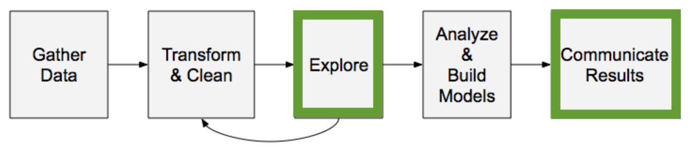

:PROPERTIES:
:ID:       63c07a9b-2388-455a-8db7-d7cb66f6c6c7
:END:
#+title: Data Analysis
#+filetags: :DataScience:

* Data Analysis Workflow

* [[id:d31a2f5c-51c6-4742-8248-8d3c8904011a][Exploratory Data Analysis]]
* [[id:16fff215-ce9c-45ca-a5d3-5e509f647732][Data Importing]]
* [[id:de66c696-5ca1-4fbc-a9b2-097ee7bf4ccd][Data Cleaning]]
* [[id:41c5482c-9098-4b60-a2ff-e3c13bfb4486][Data Visualization]]
* [[id:6eed31dd-a6eb-41f6-95b5-6125b86b3536][Data Storytelling]]
* Python Modules
- [[id:99384a8d-1cd7-45e6-9913-01a96e895630][NumPy]]
- [[id:05ef9aaa-7fa2-45b4-9ed9-d8d01c8abff2][Pandas]]
- [[id:c78f636f-88e8-4cb8-8e28-0dc34bfbaf3a][Matplotlib]]
- [[id:f86e4126-bb1a-45f1-b9b7-b00c2d98672e][Seaborn]]
- [[id:c6961658-1c4b-4f9d-8a52-e919562d6277][SciPy]]
