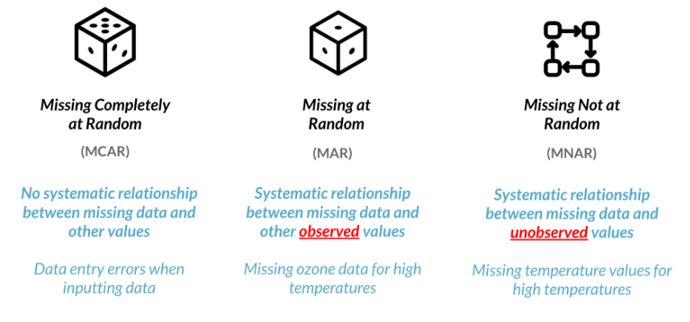
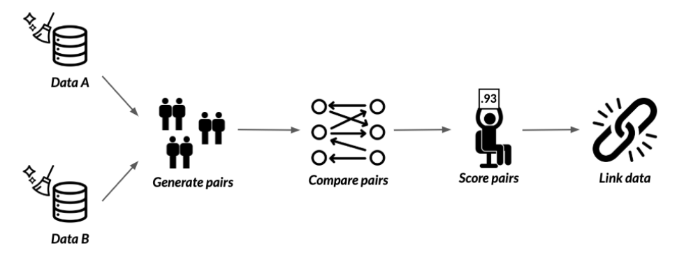
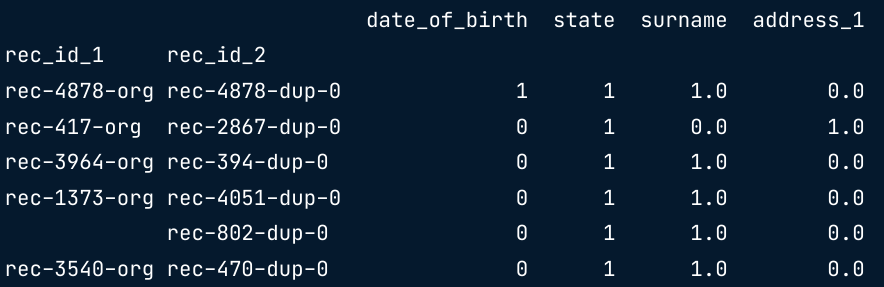

:PROPERTIES:
:ID:       de66c696-5ca1-4fbc-a9b2-097ee7bf4ccd
:END:
#+title: Data Cleaning
#+filetags: :DataScience:Python:

* Handling Outliers
- Why look for outliers?
  - may not accurately represent our data
  - can have a huge impact on mean and std
  - models may need normally distributed data
- IQR = 75th - 25th percentile
- Upper Outliers > 75th percentile + (1.5 * IQR)
- Lower Outliers < 25th percentile - (1.5 * IQR)
#+begin_src python
seventy_fifth = salaries['salary_usd'].quantile(0.75)
twenty_fifth = salaries['salary_usd'].quantile(0.25)
salary_iqr = seventy_fifth - twenty_fifth
upper = seventy_fifth + 1.5 * salary_iqr
lower = twenty_fifth - 1.5 * salary_iqr
#+end_src
- Question to ask: Why do these outliers exist?
  - More senior roles / different countries
  - Consider leaving them in the dataset
#+begin_src python
# Subsetting for outliers
outliers = salaries[(salaries['salary_usd'] < lower) | (salaries['salary_usd'] > upper)] \
    [['location', 'experience', 'salary_usd']] # location, experience may be useful for further analysis
#+end_src
-  Or if outliers are not accurate, you could just drop.
  - ~no_outliers = salaries[(salaries > lower) & (salaries < upper)]~

* Missing Values
** Checking
#+begin_src python
# Check if any columns contain missing values
df.isna().any()

# Count missing values by column
df.isna().sum()

# Bar plot of missing values by variable
df.isna().sum().plot(kind='bar')

# Compare missing and non-missing values may find patterns
complete = df[~df['col_a'].isna()]
missing = df[df['col_a'].isna()]
complete.describe()
missing.describe()

# Show the distributions of columns with missing values
df[['col_a', 'col_b']].hist() # two histograms

# Handle missing values
df.dropna() # drop rows with missing values
df.fillna(0) # fill missing values with 0
df.fillna(method='ffill') # fill missing values with previous value
#+end_src

** Strategies for Handling Missing Data
*** Dropping Missing Values
- Drop missing values if 5% or less of total values
#+begin_src python
cols_with_missing_values = df.columns[df.isna().any()]

# Drop missing value if the number of missing values is less than 5% of the total number
threshold = len(df) * 0.05
cols_to_drop = df.columns[df.isna().sum() <= threshold]
df.dropna(subset=cols_to_drop, inplace=True)
#+end_src

*** Imputing a Summary Statistic
- Impute mean, median, mode depends on distribution and context
#+begin_src python
cols_with_missing_values = df.columns[df.isna().any()]

for col in cols_with_missing_values:
    df[col] = df[col].fillna(df[col].median()[0])
#+end_src

*** Imputing by Sub-group
- Different experience levels have different median salary
#+begin_src python
salaries_dict = salaries.groupby('Experience')['Salary_USD'].median().to_dict()
salaries['Salary_USD'] = salaries['Salary_USD'].fillna(salaries['Experience'].map(salaries_dict))
#+end_src

*** Imputing with ML models
** Missing Types

*** Visualization MAR
#+begin_src python
import missingno as msno
import matplotlib.pyplot as plt

msno.matrix(df)
plt.show()

# Isolate missing and non missing values to find related columns
df[col_is_na].describe()
df[~col_is_na].describe()

sorted_df = df.sort_values('related_col')
msno.matrix(sorted_df)
plt.show()
#+end_src

* Cleaning Text Data
- ~series.replace({'old': 'new'}, inplace=True)~
- Removing whitespaces: ~series.str.strip()~ or ~series.str.strip('prefix')~
- Capitalization: ~str.title()~, ~str.upper()~, ~str.lower()~
- Use ~str.len()~ to filter rows less than required length
  - ~df.loc[df['phone'].str.len() < 10, 'phone'] = np.nan~
  - ~assert df['phone'].str.len().min() >= 10~
- Check any invalid char ~str.contains()~
  - ~assert airlines['full_name'].str.contains('Ms.|Mr.|Miss|Dr.').any() == False~

** Regular Expressions
#+begin_src python
df['phone']=df['phone'].str.replace(r'\D+', '')
#+end_src

** Typo and Similar Strings
<<Typo and Similar Strings>>
- Minimum edit distance algorithms: =Damerau-Levenshtein=, =Levenshtein=, =Hamming=, =Jaro distance=
- Possible packages: ~nltk~, ~thefuzz~, ~textdistance~
- ~thefuzz~ package example:
#+begin_src python
from thefuzz import fuzz

# Compute the similarity between two strings
fuzz.WRatio('Reeding', 'Reading') #=> 86 (0~100)
# Partial strings
fuzz.WRatio('Houston Rockets', 'Rockets') #=> 90
# Partial strings with different orderings
fuzz.WRatio('Houston Rockets vs Los Angeles Lakers', 'Lakers vs Rockets') #=> 86

# Array of possible matches
from thefuze import process
str = 'Houston Rockets vs Los Angeles Lakers'
choices = ['Lakers vs Rockets', 'Rockets vs Lakers', 'Houston vs Los Angeles', 'Heat vs Bulls']
process.extract(str, choices, limit = 2) #=> [('Lakers vs Rockets', 86), ('Rockets vs Lakers', 86)]
#+end_src
- with Pandas
#+begin_src python
states_cat = ['California', 'New York']
for state in states_cat:
    matches = process.extract(state, survey['state'], limit=survey.shape[0])
    for potential_match in matches:
        if potential_match[1] >= 80:
            df.loc[survey['state'] == potential_match[0], 'state'] = state
#+end_src

* Data Range Constraints
- How to deal with?
  - Dropping data
  - Setting custom minimums and maximums
  - Treat as missing and impute
  - Setting custom value depending on business assumptions

** How to Check?
- ~min~, ~max~, ~describe~
- Plot data

** Dropping Values
- Movie Rating Example
#+begin_src python
movies = movies[movies['avg_rating'] <= 5]
# or
movies.drop(movies[movies['avg_rating'] > 5].index, inplace=True)

assert movies['avg_rating'].max() <= 5
#+end_src
- Date Range Example
#+begin_src python
# str to date
user_signups['subscriptions_date'] = pd.to_datetime(user_signups['subscriptions_date']).dt.date

today_date = dt.date.today()

# Drop values using filtering
user_signups = user_signups[user_signups['subscriptions_date'] < today_date]

# Drop values using .drop()
user_signups.drop(user_signups[user_signups['subscriptions_date'] < today_date].index, inplace=True)
#+end_src

** Fill Values
- Movie Rating Example
#+begin_src python
movies.loc[movies['avg_rating'] > 5, 'avg_rating'] = 5
#+end_src
- Date Range Example
#+begin_src python
today_date = dt.date.today()
user_signups.loc[user_signups['subscription_date'] > today_date, 'subscription_date'] = today_date

assert user_signups['subscription_date'].max() <= today_date
#+end_src

* Uniqueness Constraints
** How to Check?
#+begin_src python
# Get duplicate rows
duplicates = height.duplicated()
print(height[duplicates].head())

# Column names to check for duplication
column_names = ['first_name', 'last_name', 'address']
duplicates = height.duplicated(subset=column_names, keep=False)
# keep: whether to keep first or last, or all(False) duplicates

# Check duplicates
duplicates[duplicates].sort_values(by='first_name')
# no duplicates if duplicate_heights.empty is True
#+end_src

** Dropping Duplicates
- ~df.drop_duplicates()~, Options:
  - ~subset~ for columns
  - ~keep~: 'first', 'last', False
  - ~inplace~

** Replacing with Aggregation Value
#+begin_src python
column_names = ['first_name', 'last_name', 'address']
summaries = {'height': 'max'}
height = height.groupby(by=column_names).agg(summaries).reset_index()

# make sure aggregation is correct
duplicates = height.duplicated(subset=column_names, keep=False)
duplicate_heights = height[duplicates]

assert duplicate_heights.empty
# or
assert duplicate_heights.shape[0] == 0
#+end_src
** Fuzzy Duplicate Values
[[file:images/screenshots/Fuzzy_Duplicate_Values/2024-12-04_11-01-27_screenshot.png]]
- No common unique identifier, ~join~ will not work
  - Use *Record Linkage*

*** Record Linkage
Record linkage is the act of linking data from different sources regarding the same entity.

- Similar to [[Typo and Similar Strings]]
#+begin_src python
import recordlinkage as rl

# Generating pairs based on a matching column
# Create a indexing object
indexer = rl.Index() # the object we can use to generate pairs from df

# Generate pairs blocked on state
indexer.block(left_on='state', right_on='state')
pairs = indexer.index(df_A, df_B) # pandas multiIndex object containing all possible pairs

# Create a comparison object
compare_cl = rl.Compare()

# Find exact matches for pairs of date_of_birth and state
compare_cl.exact('date_of_birth', 'date_of_birth', label='date_of_birth')
compare_cl.exact('state', 'state', label='state')
# label lets us set the column name in the resulting dataframe

# Find similar matches for pairs of surname and address_1 using string similarity
compare_cl.string('surname', 'surname', threshold=0.85, label='surname')
compare_cl.string('address_1', 'address_1', threshold=0.85, label='address_1')

# Find matches
potential_matches = compare_cl.compute(pairs, df_A, df_B)
# Find the only pairs we want
matches = potential_matches[potential_matches.sum(axis=1) >= 2]

# Link the dataframes
# Get the indices of the duplicates in df_B
duplicates_rows_in_B = matches.index.get_level_values(1) # or by name
# Find new rows in df_B
df_B_new = df_B.loc[~df_B.index.isin(duplicates_rows_in_B)]

# Link df
df_full = df_A.append(df_B_new)
#+end_src

* Membership Constraints (Categorical)
** Finding Inconsistent Categories
- Inconsistent Categories (Anti Join)
#+begin_src python
# To filter the wrong blood type, like ['Z', 'C'] in df['blood_type']
inconsistent_categories = set(df['blood_type']).difference(categories['blood_type'])
# return the categories that are in df['blood_type'] but not in categories['blood_type']
inconsistent_row = df['blood_type'].isin(inconsistent_categories)
inconsistent_data = df[inconsistent_row]
consistent_data = df[~inconsistent_row]
#+end_src
* Uniformity
** Temperature Example
- Plot data first
#+begin_src python
temp_fah = temperatures.loc[temperatures['Temperature'] > 45, 'Temperature']
temp_cels = (temp_fah - 32) * 5/9
temperatures.loc[temperatures['Temperature'] > 45, 'Temperature'] = temp_cels

assert temperatures['Temperature'].max() <= 45
#+end_src

** Date Example
[[file:images/screenshots/Date_Example/2024-12-03_16-44-39_screenshot.png]]
#+begin_src python
# Just for wierd date formats
birthdays['Birthday'] = pd.to_datetime(birthdays['Birthday'],
                                       # Attempt to infer format of each date
                                       infer_datetime_format=True,
                                       # Return NA for rows where conversion failed
                                       errors='coerce')
#+end_src
* Cross Field Validation
** Flight Example
#+begin_src python
sum_classes = flights[['economy_class', 'business_class', 'first_class']].sum(axis=1)
passenger_equ = sum_classes == flights['total_passengers']

inconsistent_pass = flights[~passenger_equ]
consistent_pass = flights[passenger_equ]
#+end_src

** Birthday Example
#+begin_src python
users['Birthday'] = pd.to_datetime(users['Birthday'])
today = dt.date.today()

age_manual = today.year - users['Birthday'].dt.year
age_equ = age_manual == users['Age']

inconsistent_age = users[~age_equ]
consistent_age = users[age_equ]
#+end_src
* [[id:41289401-f997-4222-97c6-60a729eb8234][scikit-learn Data Preprocessing]]
