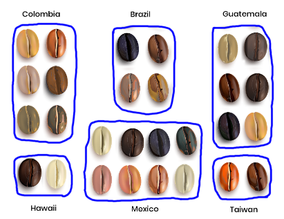

:PROPERTIES:
:ID:       2be62d58-9f1c-4c6e-a20e-5722a4e0c4e7
:END:
#+title: Data Sampling
#+filetags: :DataScience:Python:Statistics:

* Simple Random Sampling
#+begin_src python
sample_df = population_df.sample(n=20, random_state=763528) # random_state is the seed

col_a_series_pop = population_df['col_a']
col_a_series_sample = col_a_series_pop.sample(n=50)
#+end_src

* Systematic Sampling
- fixed interval
#+begin_src python
sample_size = 5
pop_size = len(pop_df) # 1338
interval = pop_size // sample_size

sample_df = pop_df.iloc[::interval]
#+end_src
- Systematic sampling is only safe if we don't see a pattern in:
  - ~df.reset_index()~ to create a 'index' column
  - ~df.plot(x='index', y='col_a', kind='scatter')~
- Making systematic sampling safe *Shuffled Dataset*
#+begin_src python
shuffled = df.sample(frac=1) # fraction = 1 means all rows
shuffled = shuffled.reset_index(drop=True).reset_index()
#+end_src

* Stratified Sampling
<<Stratified Sampling>>
Stratified Sampling sample a population that contains subgroups.
1. Split the population into subgroups
2. Use simple random sampling on every subgroup

- Issue
#+begin_src python
print(coffee_rating['country_of_origin'].value_counts().head(6)) # top 6
top_countries = ['Brazil', 'Colombia', 'Ethiopia', 'Honduras', 'Uganda', 'Mexico']
top_subset = coffee_rating['country_of_origin'].isin(top_countries)
coffee_rating_top = coffee_rating[top_subset]
coffee_rating_samp = coffee_rating_top.sample(frac=0.1, random_state=42)

# Compare the country_of_origin value proportions, may see different proportions
print(coffee_rating['country_of_origin'].value_counts(normalize=True).head(6)) # pop
print(coffee_rating_samp['country_of_origin'].value_counts(normalize=True)) # samp
#+end_src

** Proportional Stratified Sampling
#+begin_src python
coffee_rating_strat = coffee_rating_top.groupby('country_of_origin')\
                                       .sample(frac=0.1, random_state=42)
# take a simple random sample within each country
print(coffee_rating_strat['country_of_origin'].value_counts(normalize=True))
#+end_src

** Equal Counts Stratified Sampling
- ~df.groupby('category').sample(n=18)~
  - Equal proportions

* Weighted Random Sampling
- Specify weights to adjust the relative probability of a row being sampled
  - By creating a column of weights
#+begin_src python
coffee_rating_weight = coffee_ratings_top
condition = coffee_rating_weight['country_of_origin'] == 'Ethiopia'

# Set the weight to 2 for coffees from Ethiopia
# 2 times the chance of being picked compared to other coffees
coffee_rating_weight['weight'] = np.where(condition, 2, 1)

coffee_rating_weight = coffee_rating_weight.sample(frac=0.1, weights='weight')
#+end_src

* Clustering Sampling
- Problem of [[Stratified Sampling]]:
  - We need to collect data from every subgroup.
  - Clustering sampling give us an answer that almost as good while using less data
  - If grouped metric is important, clustering sampling would be a bad choice
- Clustering Sampling is a multistage sampling
  1. Use simple random sampling to pick some subgroups
  2. Use simple random sampling on only those subgroups
#+begin_src python
# 1. randomly pick subgroups
categories = list(df_pop['category'].unique())
import random
categories_samp = random.sample(categories, k=3)

# 2. sampling each subgroup
condition = df_pop['category'].isin(categories_samp)
df_cluster = df_pop[condition]
df_cluster['category'] = df_cluster['category'].cat.remove_unused_categories()

df_cluster.groupby('category').sample(n=len(df_pop)//4) # 25% of the population
#+end_src
* Examples
** 4 Dice
#+begin_src python
import itertools
import pandas as pd
dice_dict = {f'die{i}': list(range(1, 7)) for i in range(1, 5)}
rows = itertools.product(*dice_dict.values())
pop = pd.DataFrame(rows, columns=dice_dict.keys())

pop['mean_roll'] = pop.mean(axis=1)

# because mean_roll is a discrete variable,
# we can convert to category and plot bar chart
pop['mean_roll'] = pop['mean_roll'].astype('category')
pop['mean_roll'].value_counts(sort=False).plot(kind='bar')
#+end_src
- numpy simulation
  - ~np.random.choice(list(range(1, 7)), size=4, replace=True).mean()~
