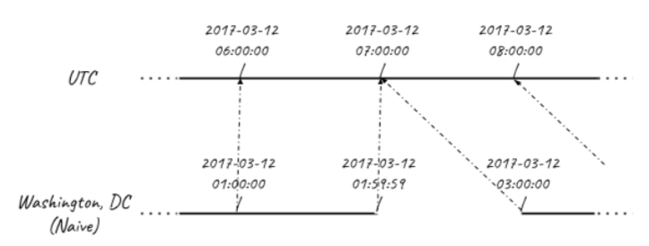
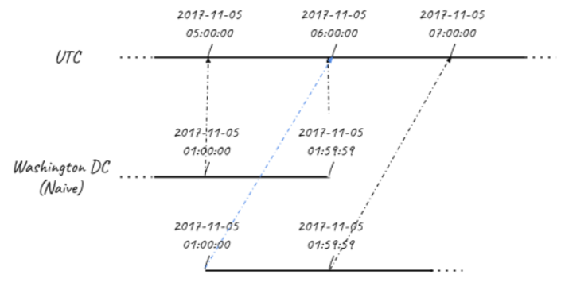

:PROPERTIES:
:ID:       2d34ce40-09a1-48ab-978e-3779d9114f78
:END:
#+title: Date and Time
#+filetags: :DataScience:Python:

* Overview
- ~datetime~: ~strptime()~ str to dt, ~strftime()~ dt to str
- ~timedelta~: ~total_seconds()~, ...

* Timezone
#+begin_src python
from datetime import datetime, timezone

CST = timezone(timedelta(hours=8))
dt = datetime(2015, 1, 1, 12, 0, 0, tzinfo=CST)

dt.astimezone(timezone.utc) # 2015-01-01 04:00:00+00:00
dt.replace(tzinfo=timezone.utc) # 2015-01-01 12:00:00+00:00
#+end_src
- Time zone database
#+begin_src python
from datetime import datetime
from dateutil import tz

et = tz.gettz('America/New_York')
dt = datetime(2019, 1, 1, 12, 0, 0, tzinfo=et)
#+end_src

* Daylight Saving Time
- The key is we need to do our math *in UTC*.
** Starting

#+begin_src python
spring_ahead_159am = datetime(2017, 3, 12, 1, 59, 59)
spring_ahead_3am = datetime(2017, 3, 12, 3, 0, 0)
print(spring_ahead_159am.isoformat()) # 2017-03-12T01:59:59
print(spring_ahead_3am.isoformat()) # 2017-03-12T03:00:00
print((spring_ahead_3am - spring_ahead_159am).total_seconds()) # 3601.0

EST = timezone(timedelta(hours=-5))
EDT = timezone(timedelta(hours=-4))
spring_ahead_159am = spring_ahead_159am.replace(tzinfo=EST)
spring_ahead_3am = spring_ahead_3am.replace(tzinfo=EDT)
print((spring_ahead_3am - spring_ahead_159am).total_seconds()) # 1
#+end_src
- Use ~dateutil~
#+begin_src python
# use dateutil
eastern = tz.gettz('America/New_York')
spring_ahead_159am = datetime(2017, 3, 12, 1, 59, 59, tzinfo=eastern) # EST
spring_ahead_3am = datetime(2017, 3, 12, 3, 0, 0, tzinfo=eastern) # EDT
print((spring_ahead_3am - spring_ahead_159am).total_seconds()) # 1
#+end_src

** Ending

#+begin_src python
eastern = tz.gettz('US/Eastern')

first_1am = datetime(2017, 11, 5, 1, 0, 0, tzinfo=eastern)

tz.datetime_ambiguous(first_1am) # True

second_1am = datetime(2017, 11, 5, 1, 0, 0, tzinfo=eastern)
second_1am = tz.enfold(second_1am) # enfold: this time belongs to the second 1am time

print((second_1am - first_1am).total_seconds()) # 0
print((second_1am.astimezone(tz.UTC) - first_1am.astimezone(tz.UTC)).total_seconds()) # 3600
#+end_src
* [[id:a707e96d-102d-4549-8abe-ffeb9a8c3e9e][Pandas Datetime]]
