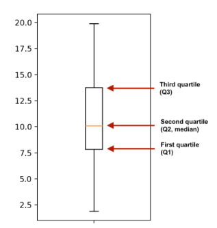

:PROPERTIES:
:ID:       925a0f11-b567-4e43-a9a7-41006a814c33
:ROAM_ALIASES: "Summary Statistics"
:END:
#+title: Descriptive Statistics
#+filetags: :Math:Statistics:

* Measure of Central
** mean
- *Mean is subject to extreme values*
  - If the data is *skewed*, median is usually better to use.
- $\mu = \frac{\sum_{i=1}^{n}x_i}{n}$
- $\mu = \frac{\sum_{i=1}^{n}freq_i \cdot x_i}{\sum_{i=1}^{n}freq_i}$
- $\mu = \sum_{i=1}^{n}p_i\cdot x_i$
- ~np.mean~

** mode
- ~series.value_counts()~
- ~statistics.mode(series)~

** median
- even: $\frac{x_\frac{n}{2} + x_{\frac{n}{2}+1}}{2}$
- odd $x_\frac{n+1}{2}$
- ~np.median~

* Measure of Spread
** Variance
- $\sigma^2 = \frac{\sum_{i=1}^n(x_i-\mu)^2}{n}$
- $\sigma^2 = \frac{\sum_{i=1}^n x_i^2}{n} - \mu^2$
- $\sigma^2 = \sum_{i=1}^n{p_i}(x_i-\mu)^2 = \sum_{i=1}^{n} p_i x_i^2 - \mu^2$
- *n-1* for *sample variance*, ~ddof=1~
- ~np.var(series, ddof=0)~

** Standard Deviation
- Symbol: $\sigma$
- Square root of variance
- ~np.std(series, ddof=1)~
  - ~np.sqrt(np.var(series, ddof=1)~

** Mean Absolute Deviation
#+begin_src python
dists = series - np.mean(series)
np.mean(np.abs(dists))
#+end_src
- *std* penalize longer distances more

** Median Absolute Deviation (Robust)
#+begin_src python
dists = series - np.median(series)
np.median(np.abs(dists))
#+end_src

** Quantiles (Robust)
- ~np.quantile(series, 0.5)~ equals to ~np.median(series)~
- Quartiles: ~np.quantile(series, [0, 0.25, 0.5, 0.75, 1])~
  - Shortcut: ~np.quantile(series, np.linspace(0, 1, 5))~

*** IQR(Interquartile Range)
- $Q_3 - Q_1$
- $Q_1$ is the medean of the first half
#+begin_src python
iqr = np.quantile(data, 0.75) - np.quantile(data, 0.25)
# or
iqr = scipy.stats.iqr(data)
#+end_src

*** Outliers
- default whiskers = 1.5
- $< Q_1 - whiskers\cdot(IQR)$
- $> Q_3 + whiskers\cdot(IQR)$
#+begin_src python
iqr = scipy.stats.iqr(data)
lower_threshold = np.percentile(data, 25) - 1.5 * iqr
upper_threshold = np.percentile(data, 75) + 1.5 * iqr
#+end_src

** Range (Max - Min)
- ~sns.catplot(..., whis=[0, 100])~
