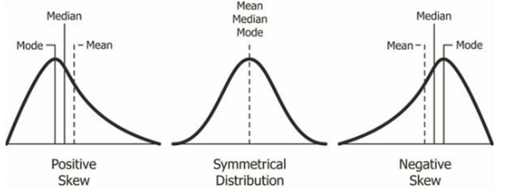

:PROPERTIES:
:ID:       5c108829-17e1-4980-9268-6e3eb555b857
:END:
#+title: Discrete Distributions
#+filetags: :Statistics:Math:Probability:

* Skewed Data

- Positive Skewed == Right Skewed
- Negative Skewed == Left Skewed

* [[id:0a97c486-67fb-40a4-b1ff-e1229a387064][Binomial Distribution]]
* [[id:408f940c-5870-4c00-b54c-6d4aea4809d6][Uniform Distribution(D)]]
* [[id:5233b01c-750c-481c-a853-b61b48eac54c][Poisson Distribution]]
