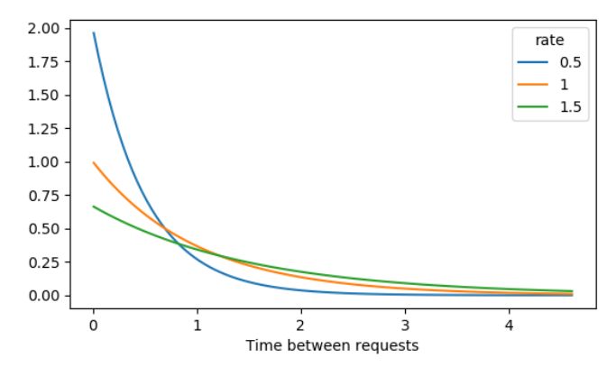

:PROPERTIES:
:ID:       6b3723fd-b1c2-432e-9176-feaec1d9b8b5
:END:
#+title: Exponential Distribution
#+filetags: :Probability:Statistics:Math:

* Definition
- Probability of time between Poisson events, see [[id:85ef2d1a-c912-46c7-a4b1-3af274c4fd4c][Poisson Process]]
  - Probability of < 10 minutes between restaurant arrivals
  - Probability of > 1 day between adoptions
- \(\lambda\) = average number of events per time interval

* Python Examples
** Calculating CDF & PPF
- On average, 2 customer service ticket is created every 4 minutes
  - \(\lambda=\frac{2}{4}=0.5\) requests per time
  - Expected value between requests:
    - \(\frac{1}{\lambda}=2\), thus, 2 minutes between requests

#+begin_src python
from scipy.stats import expon

# How long until a new request is created? P(wait < 2min)
# scale = 1 / lambda
expon.cdf(2, scale=2)

# P(wait > 4min)
1 - expon.cdf(4, scale=2)
#+end_src
