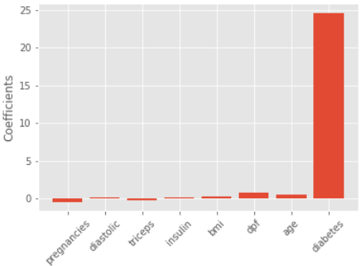

:PROPERTIES:
:ID:       d24c5dbe-3329-40a8-b8e2-3566499ce38b
:END:
#+title: Feature Selection
#+filetags: :Python:ML:

* Using Lasso Regression
- Lasso can select important features of a dataset
- Shrinks the coefficients of less important features to 0
- Features not shrunk to zero are selected by lasso
#+begin_src python
from sklearn.linear_model import Lasso
X = df.drop('target', axis=1).values
y = df['target'].values
names = df.drop('target', axis=1).columns
lasso = Lasso(alpha=0.1)
lasso_coef = lasso.fit(X, y).coef_
plt.bar(names, lasso_coef)
plt.show()
#+end_src
- example chart

