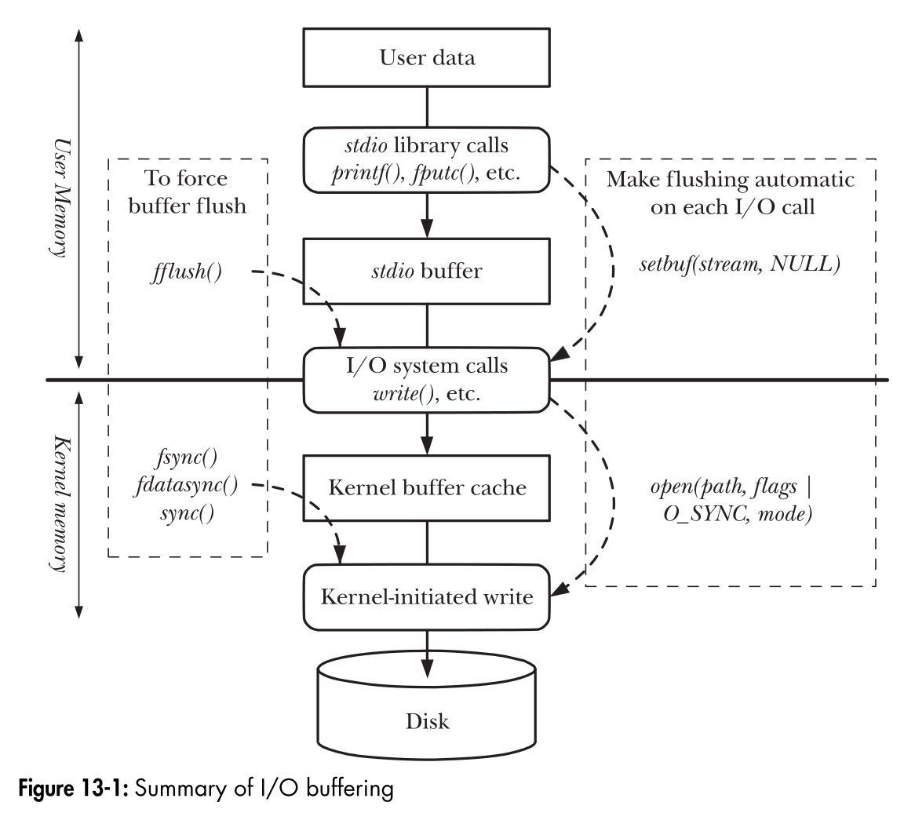

:PROPERTIES:
:ID:       c7ce9028-6f2b-467d-a4e2-989926573aa4
:END:
#+title: File IO Buffering
#+filetags: :Linux:

* System Call ~write()~ and ~read()~
Simply copy data between a user-space buffer and a buffer in the kernel /buffer cache/.
- Example: ~write(fd, "abc", 3)~
  - Transfers 3 bytes of data from a buffer in user-space memory to a buffer in kernel space, then returns.
  - At some later point, the kernel writes (flushes) its buffer to the disk.
  - The system call is not synchronized with the disk operation.
- ~read()~
  - The kernel reads data from the disk and stores it in a kernel buffer.
  - For *sequential* file access, the kernel typically performs *read-ahead*.

** Measurements
1. The time to perform ~read/write~ system calls.
2. The time to transfer data between buffers in kernel space and user space.
3. The time to transfer data between kernel buffers and the disk.

* Buffering in the ~stdio~ C Library
Buffering for data into *large blocks* to reduce system calls is what is done by the C I/O functions
- Using the stdio library relieves us of the task of buffering data for ~write/read~ system calls.

** Setting the buffering mode of a ~stdio~ stream
#+begin_src c
#include "stdio.h"

int setvbuf(FILE *stream, char *buf, int mode, size_t size);
// Returns 0 on success
#+end_src
- the ~setvbuf()~ call must be made before calling any other ~stdio~ function on the stream.
- ~buf~ and ~size~ specify the buffer to be used for stream.
- the ~mode~ specify the type of buffering
  - _IONBF: Don't buffer I/O.
  - _IOLBF: Employ line-bufferd I/O.
  - _IOFBF: Employ fully buffered I/O.
- Other variants: ~setbuf()~, ~setbuffer()~

** Difference from I/O System Call
- I/O system calls transfer data directly to the kernel buffer cache
- While the ~stdio~ library waits until the stream's user-space buffer is full before calling ~write()~
  to transfer that buffer to the kernel buffer cache.

* Library Function Summary

* Kernel Buffering
** Kernel Optimizations to Improve I/O Performance
- Performing sequential read-ahead
- Performing I/O in clusters of disk blocks
- Allowing processes accessing the same file to share buffers in the cache

** Controlling Kernel Buffering of File I/O
*** Terms
- Synchronized I/O data integrity :: file data
- Synchronized I/O file integrity :: file data + file metadata

*** Synchronized I/O Data Integrity Completion
- For a ~read~ operation
  - Means that the requested file data has been transferred (from the disk) to the process.
  - If there were any pending write operations affecting the requested data, *these are transferred to the disk before performing the read*.
- For a ~write~ operation
  - Means that the data specified in the write request has been transferred (to the disk)
  - All *file metadata required to retrieve that data* (not all modified file metadata, e.g. timestamps) has also been transferred.

*** Synchronized I/O File Integrity Completion
The difference is that during a file update, *all updated file metadata* is transferred to disk.

*** System Calls for Controlling Kernel Buffering
- ~int fsync(int fd)~: causes the buffered data and all metadata to be flushed to disk. (file integrity)
  - ~fdatasync~: data integrity. It can help reduce the number of disk I/O operations.
    - *Performance Optimization* when making *multiple file updates*.
- ~void sync(void)~: flush all! returns only after all data has been transferred to disk.

*** Opening File with ~O_SYNC~
Specifying the ~O_SYNC~ flag makes all subsequent output synchronous.
- ~fd = open(pathname, O_WRONLY | O_SYNC);~
- Every ~write()~ to the file automatically flushes the file data and metadata to the disk.
- If the disk drive has internal caches, ~O_SYNC~ merely causes data to be transferred to the cache.

**** ~O_DSYNC~
- ~O_DSYNC~ causes writes to be performed like ~fdatasync()~

**** ~O_RSYNC~
- The ~O_RSYNC~ flag is specified with ~O_SYNC~ or ~D_SYNC~
- It extends the write behaviors of these flags to *read operations*.
- ~O_RSYNC | O_DSYNC~ means that all reads are completed according to the synchronized I/O *data integrity*.
  - prior to performing the read, all pending file writes are completed.

*** Performance Hints
If we need to force flushing of kernel buffers
- use large ~write()~ buffer sizes
- make judicious use of *occasional* calls to ~fdatasync()~ or ~fsync()~
- should avoid using ~O_SYNC~ flag

** Advising the Kernel I/O Pattern
- ~int posix_fadvise(int fd, off_t offset, off_t len, int advice)~
- ~advice~ argument:
  - =POSIX_FADV_NORMAL=: default if no advice is given. It sets the file read-ahead window to the default size (128kB)
  - =POSIX_FADV_SEQUENTIAL=: the process expects to read data sequentially. read-ahead window is set to the twice the default size
  - =POSIX_FADV_RANDOM=: the process expects to access the data in random order. read-ahead is disabled.
  - =POSIX_FADV_WILLNEED=: the process expects to access the specified file region in the near future. read-ahead win from /offset/ to /len/
  - =POSIX_FADV_DONTNEED=: the process expects not to access the specified file region in the near future.
  - =POSIX_FADV_NOREUSE=: the process expects to access data in the specified file region once

* Direct I/O
Direct I/O is intended only for applications with *specialized I/O requirements*.
For example, database systems that perform their own caching and I/O optimizations
- Enabling by specify the ~O_DIRECT~ flag when opening the file.

** Alignment Restrictions
Block size means the *physical block size of the device (typically 512 bytes)*.
- The data buffer being transferred must be aligned on a memory boundary that is *a multiple of the block size*.
- The file or device offset at which data transfer commences must be *a multiple of the block size*.
- The length of the data to be transferred must be *a multiple of the block size*.

* Disk-Level Cache
- ~hdparm -I /dev/sdX~: Check the cache/buffer size.
- ~hdparm -W0~: Disable caching on the disk.

