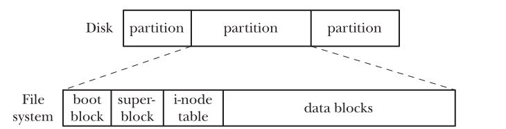

:PROPERTIES:
:ID:       72e5eb39-6c7e-41ea-9a28-86e0fb144c6f
:END:
#+title: File Systems
#+filetags: :Linux:

* Devices
- Character Devices: handle data on a character-by-character basis. e.g. Keyboards
- Block Devices: handle data a block at a time.

** API Provided by Device
~open()~, ~close()~, ~read()~, ~write()~, ~mmap()~, and ~ioctl()~

** Devices Files
- Creating by ~mknod~ command or ~mknod()~ system call
- e.g. We can create a FIFOs. (but ~mkfifo()~ is preferred)
- Each device file has a /major ID number/ and a /minor ID number/.
  - The major ID identifies the general class of device.
  - The minor ID uniquely identifies a particular device within a general class.
  - The major and minor IDs of a device file are displayed by the ~ls –l~ command.
    - e.g. =crw-r--r--   1 root      root    10,   235 Sep 16 09:30 autofs=, major: 10, minor: 235
- A device's major and minor IDs are recorded in the i-node for the device file.

** Disk Access Time
- *Seek Time*: The disk head must first move to the appropriate track.
- *Rotational Latency*: The drive must wait until the appropriate sector rotates under the head.
- *Transfer Time*: Finally the required blocks must be transferred.
- *The total time* required to carry out is typically of the order of *milliseconds*.

* File Systems
** Structure
- Block Size: 512B
- Logical Block
  - Specified as an argument of the ~mkfs~
  - The size is some multiple of contiguous physical blocks. (e.g. 1024, 2048, 4096 bytes)

*** Partitions Structure

- Boot Block: All file systems have a boot block (most of which are unused).
- Superblock contains:
  - the size of the i-node table
  - the size of logical blocks
  - the size of the file system in logical blocks
- I-node table: Each file or directory in the file system has a unique entry in the i-node table.
- Data blocks

** I-nodes
- The /i-node/ number (/i-number/) of a file is the first field displayed by the ~ls -li~
- I-node information contains:
  - File type (e.g., regular file, directory, symbolic link, character device).
  - Owner
  - Group
  - Access permissions
  - Timestamps: last access ~ls -lu~, last modification ~ls -l~, last change to i-node information ~ls -lc~
  - Number of hard links to the file
  - Size of the file in bytes
  - Number of blocks actually allocated to the file, measured in units of 512-byte blocks.
  - Pointers to the data blocks of the file

* [[id:808b8114-6d48-4268-815f-270a9e3640f8][Virtual File System]] (VFS)
* [[id:06344419-df9c-4976-8384-902338a78cc2][Journaling File Systems]]

* Important Data Structures
[[../assets/Linux/FileSharing_1.png]]
- *The per-process file descriptor table*
  - file descriptor flags: there is just one such flag, the ~close-on-exec~ flag
  - a reference to the open file description
- *The system-wide table of open file descriptions*
  - the current file offset
  - status flags specified when opening the file
  - the file access mode (read-only, read-write, etc.)
  - setting relating to signal-driven IO
  - a reference to the i-node object for this file
- *The file system i-node table*
  - file type (regular file, socket, or FIFO) and permissions
  - a pointer to a list of locks held on this file
  - properties of the file, such as size, timestamps etc.

* File System Benchmarks
- Performance under heavy multi-user load
- Speed of file creation and deletion
- Time required to search for a file in a large directory
- Space required to store small files
- Maintenance of file integrity in the event of a system crash.

* Buffering
- [[id:c7ce9028-6f2b-467d-a4e2-989926573aa4][File IO Buffering]]
- [[id:a20150eb-3731-4848-8a33-c55c4a318b7b][Page Cache]]

* Details
- [[id:937b44b4-497a-466a-924d-0a01a2228266][File Descriptor]]
- [[id:537013df-12ee-47e1-9e1f-babe976d26fa][Hard Link]]
- [[id:d81b6ab9-c4fc-4ed3-85f7-dd239e60dcc9][inode]]
- [[id:3876fd6e-5f00-449c-bd49-6cdde0e05ab0][dentry]]
- [[id:be6c0364-12d4-4602-aaee-c1db280685a4][Sharing Files Between Processes]]
