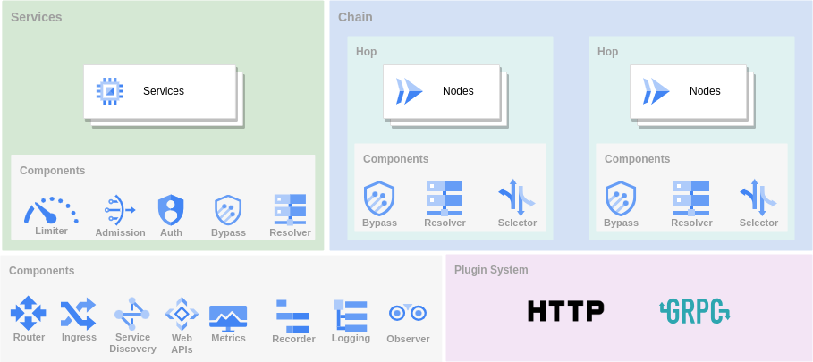

:PROPERTIES:
:ID:       4cfade54-5db2-4bc1-a4a1-561bce26aac7
:END:
#+title: GOST
#+filetags: :Network:

* Concept

- Services
  - Handler: e.g. http
  - Lister: data tunnel
- Chains
  - Hops
    - Nodes
      - Connector
      - Dialer

* Authentication
- Server
  - ~gost -L http://user:pass@:8080~
- Client
  - ~gost -L http://:8080 -F socks5://user:pass@:1080~

** Using base64
- Server
  - ~echo -n user:pass | base64~ -> ~dXNlcjpwYXNz~
  - ~gost -L http://:8080?auth=dXNlcjpwYXNz~
- Client
  - gost -L http://:8080 -F socks5://:1080?auth=dXNlcjpwYXNz

** Authenticator
An authenticator contains one or more sets of authentication information.
#+begin_src yaml
services:
- name: service-0
  addr: ":8080"
  handler:
    type: http
    auther: auther-0
  listener:
    type: tcp
authers:
- name: auther-0
  auths:
  - username: user1
    password: pass1
  - username: user2
    password: pass2
#+end_src
