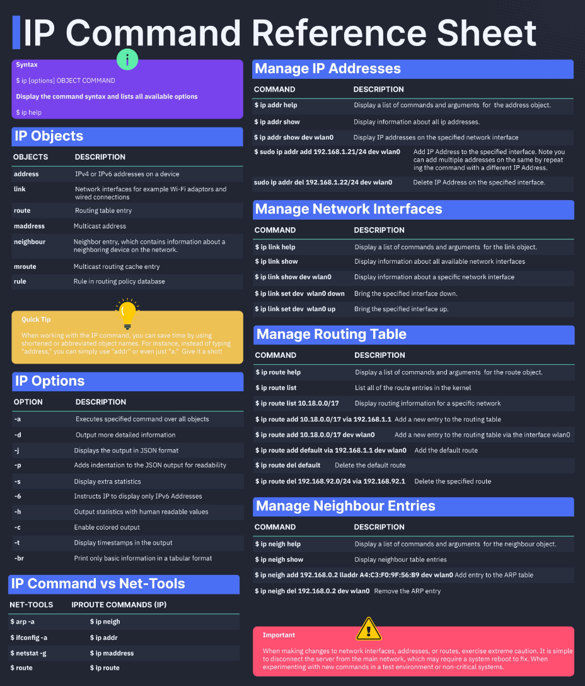

:PROPERTIES:
:ID:       6f61b842-c5db-4bde-b2bd-46f94ea2568e
:END:
#+title: ~ip~
#+filetags: :Tools:Network:

* Cheat Sheet

* Syntax
- ~ip OBJECT COMMAND~
- ~ip [options] OBJECT COMMAND~
- ~ip OBJECT help~

** Objects
| Object    | Abbr.    | Purpose                                            |
|-----------+----------+----------------------------------------------------|
| link      | l        | Network device.                                    |
| address   | a, addr  | Protocol(IP/IPv6) address on a device.             |
| addrlabel | addrl    | Label configuration for protocol adress selection. |
| neighbour | n, neigh | ARP or NDISC cache entry.                          |
| route     | r        | Routing table entry.                               |
| rule      | ru       | Rule in routing policy database                    |
| maddress  | m, maddr | Multicast address.                                 |
| mroute    | mr       | Multicast routing cache entry.                     |
| tunnel    | t        | Tunnel over IP                                     |
| xfrm      | x        | Framework for IPsec protocol                       |

- To get help
  - ~ip OBJECT h/help~

** Useful Options
- ~-c~: color output
  - Add ~alias ip="ip -c"~ to =.zshrc=
- ~-br~: print only basic information
  - ~ip -br -c addr show~
  - ~ip -br -c link show~

* ~ip addr~
- list all ip address: ~ip addr~
  - ~ip -4 a~, ~ip -6 a~
- specify the interface: ~ip -4 a show lo~
- show running interfaces: ~ip link show up~

** Adding/Deleting
- ~ip addr add~
- ~ip addr del~, ~ip addr flush~
  - e.g. ~ip -4 addr flush label "ppp*"~

** Modifing
- change state: ~ip link set dev {DEVICE} {up|down}~
  - e.g. ~ip link set dev eth1 down~
- change txqueuelen: ~ip link set txqueuelen {NUMBER} dev {DEVICE}~
- change mtu: ~ip link set mtu {NUMBER} dev {DEVICE}~

* ~ip neigh~
- display neighbour/arp cache: ~ip n show~
  - STALE: The kernel will try to check it at the first transmission
  - DELAY: The kernel sent a packet to the STALE neighbour, waiting for confirmation.
  - REACHABLE

** Add/Removing ARP Entry
- ~ip neigh add {IP} lladdr {MAC} dev {DEVICE} nud {STATE}~
  - STATE: /permanent/, /noarp/, /stale/, /reachable/
  - e.g. ~ip neigh add 192.168.1.5 lladdr 00:1a:30:38:a8:00 dev eth0 nud perm~
- ~ip neigh del {IP} dev {DEVICE}~, ~ip -s -s neigh flush {IPAddress}~
  - e.g. ~ip -s -s n flush 192.168.1.5~
* ~ip route~
- show routing tables: ~ip r list~
  - display routing for CIDR: ~ip r list 192.168.1.0/24~

** Adding/Deleting Route
- ~ip route add [default] {CIDR} via {GATEWAYIP}~
- ~ip route add [default] {CIDR} dev {DEVICE}~
- e.g. route all traffic connected via eth0
  - ~ip route add 192.168.1.0/24 dev eth0~
- delete the default route: ~ip route del default~
- ~ip route del 192.168.1.0/24 dev eth0~

** Changing MAC Address
#+begin_src bash
NIC="eth0"
ip link show $NIC
ip link set dev $NIC down
ip link set dev $NIC address 00:11:22:33:44:55
ip link set dev $NIC up
#+end_src
* Old vs. New
| Old command                           | New command                            |
|---------------------------------------+----------------------------------------|
| ~ifconfig eth0 up/down~               | ~ip link set eth0 up/down~             |
| ~ifconfig eth0 192.168.2.24~          | ~ip addr add 192.168.2.24/24 dev eth0~ |
| ~ifconfig eth0 netmask 255.255.255.0~ | ~ip addr add 192.168.1.1/24 dev eth0~  |
| ~ifconfig eth0 mtu 2000~              | ~ip link set eth0 mtu 2000~            |
| ~ifconfig eth0:0 192.168.2.25~        | ~ip addr add 192.168.2.25/24 dev eth0~ |
| ~netstat~                             | ~ss~                                   |
| ~netstat -tulpn~                      | ~ss -tulpn~                            |
| ~netstat -neopa~                      | ~ss -neopa~                            |
| ~netstat -g~                          | ~ip maddr~                             |
| ~route~                               | ~ip r~                                 |
| ~route add~                           | ~ip route add~                         |
| ~arp -a~                              | ~ip neigh~                             |
| ~arp -v~                              | ~ip -s neigh~                          |
| ~arp -s~                              | ~ip neigh add~                         |
| ~arp -i~                              | ~ip neigh del~                         |
