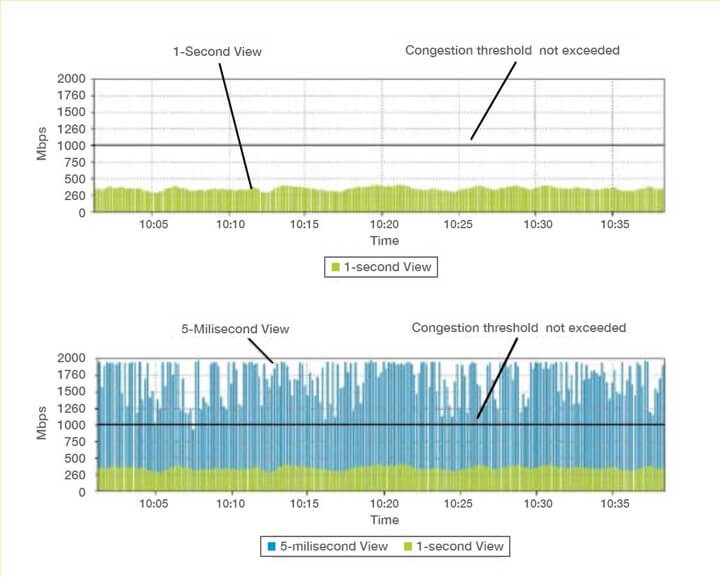
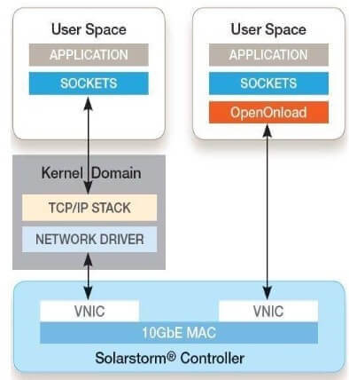
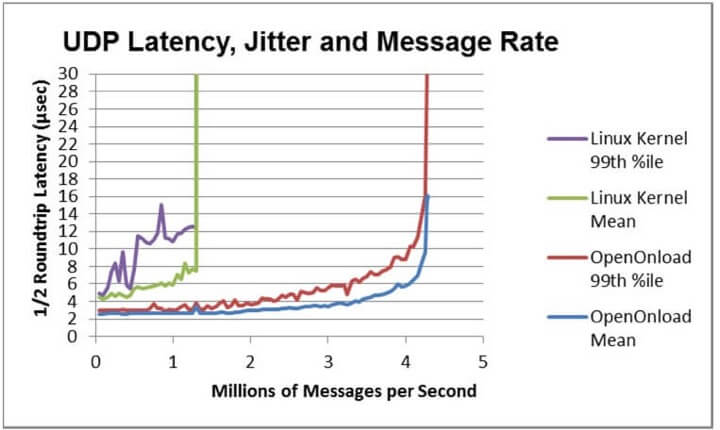
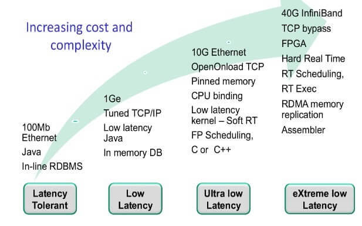

:PROPERTIES:
:ID:       dbc6bea0-6803-45f0-8fa1-1f3aefc1731b
:END:
#+title: Low Latency Design
#+filetags: :Trading:
* Why
- The strategy makes sense only in a low latency environment
- Survival of the fittest – competitors pick you off if you are not fast enough

* Latency Sources
** Propagation Latency
It signifies the time taken to send the bits along the wire, *constrained by the speed of light*.
*** Optimizations
- Reduces the physical distance
- Microwave communication
  - RTT for an ordinary cable between Chicago and New York is 12.98 milliseconds.
  - RTT for microwave communication is to 8.5 milliseconds.
  - Theoretical minimum is about 7.5 milliseconds
- Laser communication have further shaved off an already thinning latency by nanoseconds *over short distances*.

** Network Processing Latency
It is introduced by routers, switches, etc.
*** Optimizations
- Reduces the number of hops that a packet would take to travel from A to B.

*** Microbursts Issue
A *sudden* increase in the rate of data transfer which may not necessarily affect the average rate of data transfer.

- The transfer rate has spiked above the available bandwidth several times each second in the 5-millisecond view.

** Serialization Latency
Serialisation latency signifies the time taken to pull the bits on and off the wire.

** Interrupt Latency
Interrupt latency is defined as the time elapsed between when an interrupt is generated to when the source of the interrupt is serviced.
- The time taken to respond to the interrupt
  - not only affects the processing of the newly arriving payload
  - but also the latency of the existing processes on the processor.

*** Optimizations
- OpenOnload: introduced by Solarflare
  - Implements a technique known as kernel bypass, the processing of the packet is left to the userspace itself.
  - As a result, interrupts are completely avoided.

** Application Latency
It signifies the time taken by the application to process. It depends on
- the processing allocated to the application logic
- the complexity of the calculation involved
- programming efficiency

*** Optimization
- Dedicates processor cores to essential parts like the strategy logic
  - This avoids the latency introduced by the process of switching between cores.
- Increases cache hits: awareness of cache sizes and locality of memory access
  - may use low-level programming languages to optimize the code to the specific architecture of the processors.
  - FPGA: *Fully Programmable Gate Arrays*

* Cost and Complexity

