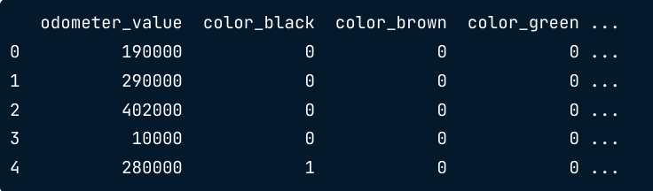

:PROPERTIES:
:ID:       c73b007a-f41e-4f9e-b2b9-41be79452544
:END:
#+title: Manipulating Categorical Data
#+filetags: :DataScience:Python:

* Overview
- Nominal
  - *astype*: ~df['str_col'].astype('category')~
  - ~pd.Series(my_list, dtype='category')~
  - ~pd.read_csv('data.csv', dtype={'Status': 'category'})~
- Ordinal
  - ~pd.Categorical(my_list, categories=['C', 'B', 'A'], ordered=True)~
- Category type saves memory: ~series.nbytes~
- Show all possible values: ~series.unique()~

* Converting to Categorical Data
** String to Category
#+begin_src python
# 0        19h
# 1     5h 25m
# 2     4h 45m
# 3     2h 25m
# 4    15h 30m
# Name: Duration, dtype: object
flight_categories = ["Short-haul", "Medium", "Long-haul"]
short_flights = "^0h|^1h|^2h|^3h|^4h"
medium_flights = "^5h|^6h|^7h|^8h|^9h"
long_flights = "10h|11h|12h|13h|14h|15h|16h"
conditions = [
    flights["Duration"].str.contains(short_flights),
    flights["Duration"].str.contains(medium_flights),
    flights["Duration"].str.contains(long_flights)
]
planes["Duration_Category"] = np.select(conditions,
                                        flight_categories,
                                        default="Extreme duration")
sns.countplot(x="Duration_Category", data=planes)
#+end_src

** Number to Category
#+begin_src python
age_bins = [0, 17, 25, 34, 44, 54, 64, np.inf]
age_labels = ['0-17', '18-25', '26-34', '35-44', '45-54', '55-64', '65+']
crimes['Age Bracket'] = pd.cut(crimes['Vict Age'], bins=age_bins, labels=age_labels)
#+end_src

* ~cat~ Accessor
- Set: ~df['status'].cat.set_categories(new_categories=['created', 'running', 'finished'])~
  - all values not specified are dropped (None)
- Add: ~df['status'].cat.add_categories(new_categories=['creating', 'canceled'])~
- Remove: ~df['status'].cat.remove_categories(removals=['creating'])~
  - set 'creating' to None
- Rename: ~df['status'].cat.rename_categories({'running': 'processing'})~
  - Using lambda function: ~df['status'].cat.rename_categories(lambda c: c.upper())~
- Check (identifying issues): ~series.cat.categories~ or ~series.value_counts~
- Replace strings, then convert to ~Categorical~
  - ~series.replace({'running': 'processing'})~
  - Then convert back to ~Categorical~

* Reordering Categories
- Why?
  - Creating a ordinal variable
  - To set the order that variables are displayed in analysis
  - Memory savings
#+begin_src python
dogs['coat'].cat.reorder_categories(new_categories=['short', 'medium', 'long'],
                                    ordered=True, inplace=True)
#+end_src
- affects:
  - the order of grouped result
  - the order of printout
- ~ordered=False~: can still reorder for display purposes without the category being ordinal.

* Categorical Pitfalls
- ~.str~ accessor converts category to an object
- ~.apply()~ converts category to an object
- ~.cat~ accessor methods do not all handle missing categories in the same way
- NumPy functions do not work with categorical series

** Handle Problems
- Check and convert: ~series.dtype~, ~series.astype('category')~
- Look for missing values: use ~s.value_counts(dropna=False)~ to check after using ~.cat~ accessor
- NumPy calculation: ~s.astype(int).sum()~

* Label Encoding
- Code each category as an integer from \(0\) to \(n-1\)
  - \(-1\) is reserved for any missing values
- Advantages
  - Can save on memory
  - Simplify responses when using survey data
- Drawbacks
  - Can be used in ML models; But not the best encoding method for ML

** Python Codes
- Creating codes: ~df['cat_codes'] = df['category'].cat.codes~
- Creating code book: ~code_book = dict(zip(codes, categories))~
- Reverting to categorical values: ~df['cat_codes'].map(code_book)~

*** Boolean Encoding
#+begin_src python
# Create a boolean coding
used_cars['van_code'] = np.where(
    used_cars['body_type'].str.contains('van', regex=False),
    1, 0) # or True, False
# if values are 1 and 0, python can use them in algorithms
used_cars['van_code'].value_counts()
#+end_src

* One-hot Encoding
One-hot encoding is the process of creating dummy variables
- ~pd.get_dummies(data=df, columns=['cat', 'num'], prefix='cat')~
  - any numeric columns will remain the same
  - The categorical variable is removed and replaced with the one-hot encoded variables.
#+begin_src python
used_car_onehot = pd.get_dummies(used_car[['odometer_value', 'color']])
used_car_onehot.head()
#+end_src

#+begin_src python
used_cars_onehot = pd.get_dummies(used_cars, columns=['color'], prefix='')
#+end_src
