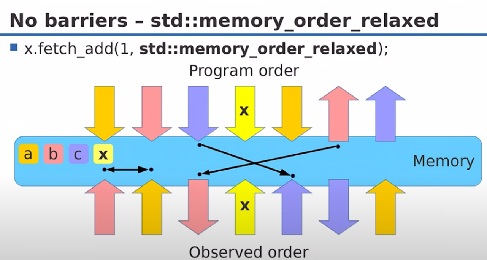
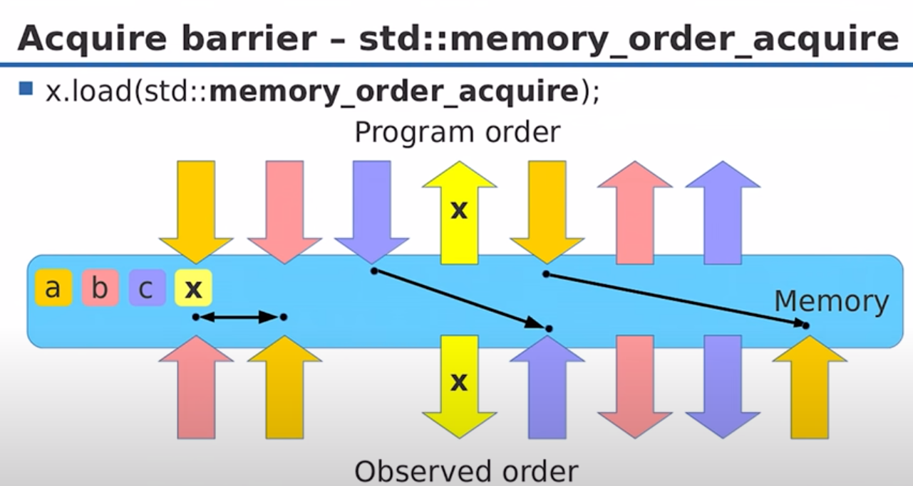
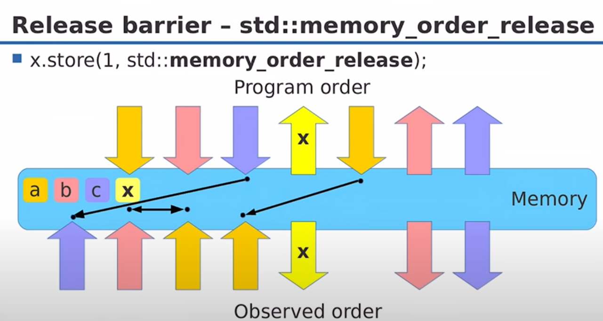

:PROPERTIES:
:ID:       89931198-0b9b-486a-880e-2029569ed6cc
:ROAM_ALIASES: Fences "Memory Orders"
:END:
#+title: Memory Barriers
#+filetags: C++
* Overview
- What guarantees that other threads see this memory in the desired state
  - For acquiring exclusive access: data may be prepared by other threads, must be completed.
  - For releasing into shared access: data is prepared by the owner threads, must become visible to every one.
- Memory barriers are *implemented by the hardware*.
- Barriers ensure the *specified order* of reads and writes.
- C++ Memory barriers are *modifiers on atomic operations*

- Three memory-ordering models:
  - /sequentially consistent/ ordering (~memory_order_seq_cst~)
  - /acquire-release/ ordering (~acquire, release, acq_rel~)
  - /relaxed/ ordering (~memory_order_relaxed~)

* No Barriers

#+DOWNLOADED: screenshot @ 2024-02-27 10:32:42

- The compiler can reorder the instructions
- The different CPU caches can hold different values for the same memory

* Acquire Barriers
It guarantees that *all memory operations* scheduled after the barrier in the program order *become visible after the barrier*.

#+DOWNLOADED: screenshot @ 2024-02-27 10:38:18

- It ensures that the last three operations become visible after the barrier

* Release Barriers
It guarantees that *all memory operations* scheduled before the barrier in the program order *become visible before the barrier*.

#+DOWNLOADED: screenshot @ 2024-02-27 10:44:07

* Acquire-release Order
- Acquire and release barriers are often used together
  - Thread1 *writes* atomic variable x with *release barrier*
  - Thread2 *reads the same* atomic variable x with *acquire barrier*
- All memory writes that happen in Thread1 before the barrier become visible in Thread2 after the barrier
  - Thread1 *prepares data then releases*(*publishes*) it by updating atomic variable
  - Thread2 *acquires atomic variable and data is guaranteed to be visible*
- ~std::memory_order_acq_rel~

** Example
#+begin_src c++
bool x = false;
std::atomic<bool> y;
void write_x_then_y() {
    x = true;

    // same as y.store(true, std::memory_order_release);
    std::atomic_thread_fence(std::memory_order_release);
    y.store(true, std::memory_order_relaxed);
}

void read_y_then_x() {
    while (!y.load(std::memory_order_relaxed));
    std::atomic_thread_fence(std::memory_order_acquire);
    cassert(x == true);
}
#+end_src

* Sequential Consistency
It establishes single total modification order of atomic variables.
- Sequential Consistency is not a memory barrier, it's a memory order.
- Sequential Consistency makes your program slow
  - It requires *global synchronization* between all threads.
  - The strongest and default ordering model
  - Lock implementation does not need ~seq_cst~, only *acquire and release*.
- ~std::memory_order_seq_cst~

* On x86
- All loads are acquire-loads, all stores are release-stores
- Adding the other barrier is expensive
- All *read-modify-write* operations are acquire-release
- ~acq_rel~ and ~seq_cst~ *are the same thing* on x86
