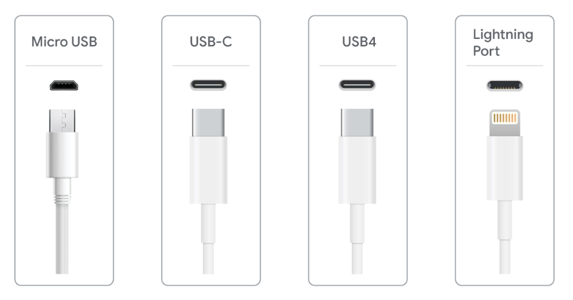
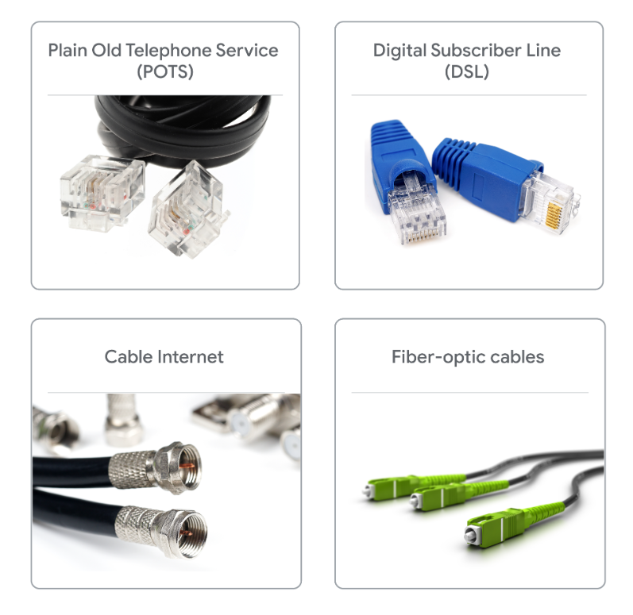
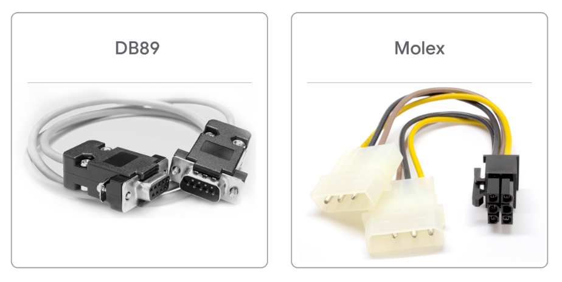

:PROPERTIES:
:ID:       4baf1454-8d95-40de-ac60-2a13a4eeae60
:END:
#+title: Motherboard
#+filetags: :Hardware:

* Chipsets
- North Bridge :: interconnects RAM and video cards, may be directly integrated into modern CPU.
- South Bridge :: maintains input/output(IO) controllers

* Expansion Slots
Gives us the ability to increase the functionality of our computer.
- PCI Express (Peripheral Component Interconnect Express)

* Form Factor
Determines the amount we can put in and amount of space we'll have.
- ATX (Advanced Technology Extended)
- ITX (Information Technology Extended): much smaller than ATX.
  - mini ITX
  - nano ITX
  - pico ITX

* Hard Drives
- HDD: Hard Disk Drive
- SDD: Solid State Drive

** Interfaces
- SATA (Serial ATA): Interface which uses one cable for data transfers
  - Hot Swappable: You don't have to turn off your machine to plug in a SATA drive
- NVMe (NVM Express): Designed for high-speed SSDs

* Power Supplies
- DC (Direct Current): Flows in one direction.
- AC (Alternating Current)

Power supply converts the AC we get from the wall into low voltage DC power that we can use.

** Electric
- voltage: the pressure to push electricity.
- current(or amperage): measured in amps.
  - Think of amps as pulling electricity as opposed to voltage.
  - larger amps will charge a device faster.
- wattage: the amount of volts and amps that a device needs.

** Selecting a Power Supply
- Wall socket input voltage standard for the country where the computer will be used
- The number and power consumption needs of the computer’s internal components
- The motherboard model and form factor engineering specifications and requirements

* Connectors
** Old USB Connectors
- USB 2.0: Black port on the computer, 480 Mbps transfer speed
- USB 3.0: Blue port on computer, 5 Gbps transfer speed
- USB 3.1: Teal port on the computer, 10 Gbps transfer speed

** New Connectors

- *Micro USB* is a small USB port found on many non-Apple cellphones, tablets, and other portable devices.
- *USB-C* is the newest reversible connector with either end having the same build. USB-C cables replace traditional
  USB connectors since they can carry significantly more power and transfer data at 20 Gbps.
- *USB4* uses Thunderbolt 3 protocol and USB-C cables to transfer data at speeds of 40 Gbps and provide power as well.
- *Lightning Port* is a connector exclusive to Apple that is similar to USB-C.

** Communication Connectors

** Device Connectors

- DB89 connectors are used for older peripherals like keyboards, mice, and joysticks.
- Molex connectors provide power to drives or devices inside the computer. Molex connectors are used for connecting a hard drive, disc drive (CD-ROM, DVD, Blu-ray), or a video card.
