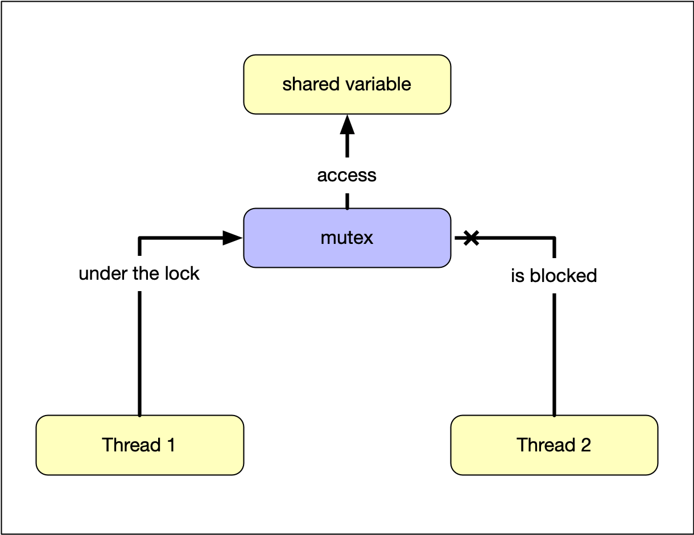

:PROPERTIES:
:ID:       d0df6e46-ba6c-4edc-9105-01a8d7692d68
:END:
#+title: Mutex
#+filetags: C++

* Overview
Mark all the pieces of code that access the data structure as *mutually exclusive*, i.e. *mutex*. It is important to understand that *a mutex is bound to the memory it protects*.

/Lock/ the mutex *associated with* that data, and when you finished accessing the data structure, you /unlock/ the mutex.

This ensures that all threads see a *self-consistent* view of the shared data.

#+DOWNLOADED: screenshot @ 2024-02-20 12:58:12

* Usage
1.  Include the ~<mutex>~ header
2.  Create an ~std::mutex~
3.  Lock the mutex using ~lock()~ *before read/write is called*
4.  Unlock the mutex *after the read/write operation* is finished using ~unlock()~

* Practical Suggestion

- It's common to *group the mutex and the protected data together in a class*.
- Protecting data with a mutex requires careful interface design.
  - Don't pass pointers and references to protected data outside the scope of the lock.

* Cons
- may cause *deadlock*
- protecting too much or too little data

* An Example
#+begin_src cpp
  #include <mutex>
  #include <list>

  std::list<int> a_list;
  std::mutex a_mutex;

  void add_to_list(int value) {
    std::lock_guard<std::mutex> guard{a_mutex};
    // std::scoped_lock guard{a_mutex}; // C++ 17
    a_list.push_back(value);
  }
#+end_src
- ~std::scoped_lock guard{a_mutex}~: *template argument deduction*
- ~std::scoped_lock~: the enhanced version of ~std::lock_guard~

* ~std::timed_mutex~
:PROPERTIES:
:ID:       46aa6368-ee91-44a8-937a-9c625b6334dc
:END:
Similar to mutex, but it comes with two more methods ~try_lock_for()~ and ~try_lock_until()~ that try to acquire the mutex for a period of time or until a moment in time is reached.

* ~std::shared_mutex~
:PROPERTIES:
:ID:       13775fe9-1e49-48d0-9c77-4cd7eeca9d4b
:END:
Used for rarely updated data.
- exclusive access by a single "writer" thread
- concurrent access by multiple "reader" threads
*** Implementation
- C++17 provides ~std::shared_mutex~ and ~std::shared_timed_mutex~
- C++14 only features ~std::shared_time_mutex~
- ~std::lock_guard~ and ~std::unique_lock~ for "writer"
- ~std::shared_lock~ for "readers"

* ~std::recursive_mutex~
:PROPERTIES:
:ID:       50dcf366-a8c5-462d-9249-5f83cdbf1aa1
:END:
Most of the time, if you want a recursive mutex, you probably need to change your design instead.
