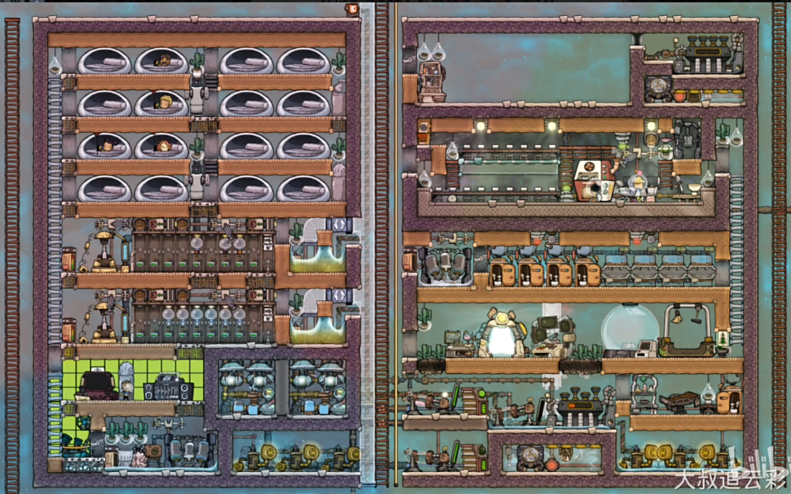

:PROPERTIES:
:ID:       dcc27a97-92dc-4e4f-ae2a-d0a8979a05c7
:END:
#+title: 缺氧
#+filetags: :Game:

* 选人
- 初始必选两位：挖掘建造、科研
- 第三位高难度选烹饪；供应、装饰、医疗、整理不选

** 特质
- 需避免的负面特质
  - 缓慢学习者、面条臂、肠易激综合征、无底洞之胃、大口呼吸者、黑暗恐惧症、发作性睡病
  - 鼾声如雷：错开睡觉时间

* 初始安排
1. 日程表排班 多排班错开 3休3寝
2. 小人优先级：初始高优先级（攻击、维生、切换、医疗、整理） 禁止（烹饪、装饰）
3. 检查温度（绿色适合种植）、材料概览

* 游戏进程
** 周期1
- 为造建筑可拆口粮箱
- 朝有水的地方挖，造水泵建厕所+洗手盆，洗手盆位置在食物和厕所之间
- （可选）规划基地，房间层高4格
- 自动收获成熟植物

** 周期2-4
- 传送门旁造研究站
- 建造人力发电、电池（大电池）、氧气扩散器（消耗藻类）
- 挖出两个房间，卧室（造高处）、餐厅(卧室右侧)，卧室放床
- 调优先级：研究员操作研究，两个小人挖掘建造

** 周期5
- 高级餐厅

* 科技
- 1级消耗泥土，2级消耗水，3级消耗数据磁盘
- 开局：医疗、装饰不研究，出食堂点餐桌，其它选项电池、碎石机、超级计算机

* Tips
- 多检查小人任务清单，了解他们在做什么
- 如果规划自然保护区，地上泥土不要挖
- 挖掘先挖上两排，后挖下两排，避免小人卡住
- 植物直接挖它下面的地块，比直接挖快
- 氧气含量（500 克/格 ~ 4000 克/格）
  - 小人消耗氧气 (100 g/s)
  - 氧气扩散器 (500 g/s) 五个小人（藻类充足情况下）
- 不腐烂食物：营养棒、淤泥根、六角根果、沼泽甜菜心、浆果糕
- 开局招小人需考虑食物量：1小人消耗 1000千卡/周期
- 避免红色警报

* 基地参考

