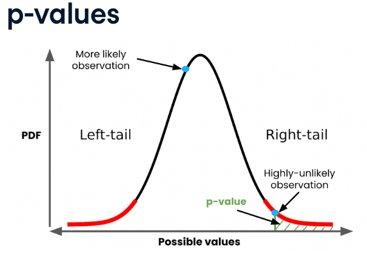

:PROPERTIES:
:ID:       4946fa5a-e743-4270-bee9-82e029890d7c
:END:
#+title: P-Values
#+filetags: :Statistics:

* Overview
Probability of obtaining a result, assuming the null hypothesis is true.
- Quantify evidence for the null hypothesis
- A smaller p-value means stronger evidence in favor of the alternative hypothesis
- Large p-value -> fail to reject null hypothesis
  - if \(p\le\alpha\), reject \(H_{0}\)

