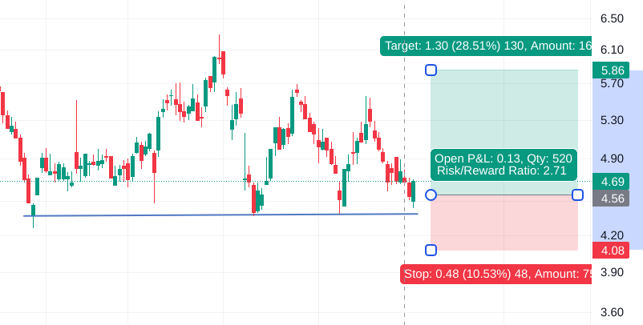

:PROPERTIES:
:ID:       b2753eb5-588b-45f7-8910-0d799d31f0c8
:END:
#+title: Portfolio Management
#+filetags: :Trading:

* Simple Strategy
- position size = (Max loss per trade) / (Amount you can lose per share)
  - Max loss per trade: 5% (see [[id:a8be299b-df31-4034-9332-355601045101][Money Management]])

** Example

- Max loss per trade
  - Account: 100K
  - $100000 * 2% = 2000$
- Max lose per share
  - Purchase price: 4.56
  - Stop loss price: 4.08
  - Max lose per share = 4.56 - 4.08 = 0.48
- $PositionSize=\frac{2000}{0.48}=4166$ shares
  - Verification: $0.48\times4166=1999.68$
