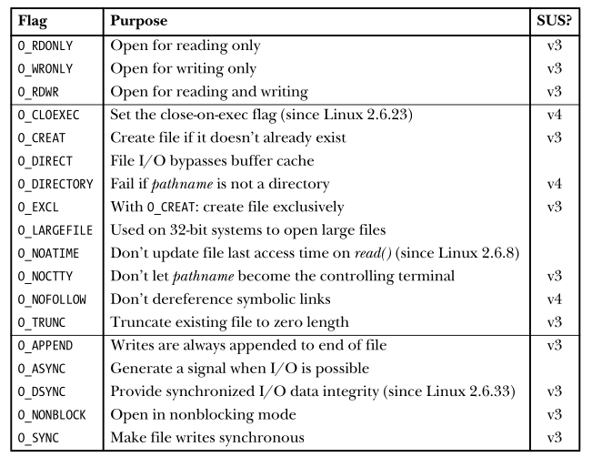
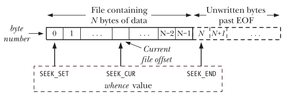

:PROPERTIES:
:ID:       3452cc2e-08e5-48cb-b7ff-5dcfc30455dd
:ROAM_REFS: cite:LinuxProgrammingInterface2010Ker
:END:
#+FILETAGS: :Book:
#+TITLE: The Linux Programming Interface
- tags :: Linux,Operating systems (Computers),UNIX (Computer file)

* The Linux programming interface
:PROPERTIES:
:Custom_ID: LinuxProgrammingInterface2010Ker
:URL:
:AUTHOR: Kerrisk, M.
:NOTER_DOCUMENT: ~/Dropbox/Zotero/Files/LinuxProgrammingInterface2010Ker.pdf
:NOTER_PAGE: 126
:END:
** File I/O
*** Summary
#+begin_src cpp
  #include <sys/stat.h>
  #include <fcntl.h>
  int open(const char *pathname, int flags, ... /* mode_t mode */);
  int creat(const char *pathname, mode_t mode);

  #include <unistd.h>
  ssize_t read(int fd, void *buffer, size_t count);
  ssize_t write(int fd, const void *buffer, size_t count);
  int close(int fd);
  off_t lseek(int fd, off_t offset, int whence);

  // Operations Outside the Universal I/O Model
  #include <sys/ioctl.h>
  int ioctl(int fd, int request, ...);

#+end_src
*** ~open()~
- flags of ~open()~
#+DOWNLOADED: screenshot @ 2023-06-08 17:58:50

**** ~close-on-exec~ flag
:PROPERTIES:
:NOTER_PAGE: 119
:HIGHLIGHT: #s(pdf-highlight 119 ((0.1839323467230444 0.7080000000000001 0.8308668076109937 0.8032)))
:END:
#+BEGIN_QUOTE
~O_CLOEXEC~ (since Linux 2.6.23)
Enable the ~close-on-exec~ flag (~FD_CLOEXEC~) for the new file descriptor. We
describe the ~FD_CLOEXEC~ flag in Section 27.4. Using the ~O_CLOEXEC~ flag allows a
program to avoid additional ~fcntl()~ ~F_SETFD~ and ~F_SETFD~ operations to set the
~close-on-exec~ flag. It is also necessary in multithreaded programs to avoid
the race conditions that could occur using the latter technique.
#+END_QUOTE
*** ~write()~
:PROPERTIES:
:NOTER_PAGE: 124
:HIGHLIGHT: #s(pdf-highlight 124 ((0.22392086330935254 0.6460176991150443 0.8111510791366907 0.685500340367597)))
:END:
#+BEGIN_QUOTE
On success, write() returns the number of bytes actually written; this may be
less than count. For a disk file, possible reasons for such a partial write are that the
disk was filled or that the process resource limit on file sizes was reached.
#+END_QUOTE

#+BEGIN_QUOTE
When performing I/O on a disk file, a successful return from write() doesn’t
guarantee that the data has been transferred to disk, because the kernel performs
buffering of disk I/O in order to reduce disk activity and expedite write() calls.
#+END_QUOTE
*** ~close()~
:PROPERTIES:
:NOTER_PAGE: 125
:HIGHLIGHT: #s(pdf-highlight 125 ((0.6913319238900635 0.25120000000000003 0.25898520084566595 0.22080000000000002)))
:END:
#+BEGIN_QUOTE
Furthermore, file descriptors are a consumable resource, so failure to close a file descriptor could result in a process running out of descriptors. This is a particularly important issue when writing long-lived programs
#+END_QUOTE
*** ~lseek()~
Interpreting the whence argument of ~lseek()~
#+DOWNLOADED: screenshot @ 2023-06-08 18:28:03

The whence argument indicates the base point from which offset is to be interpreted, and is one of the following values:

- ~SEEK_SET~ :: The file offset is set /offset/ bytes from the beginning of the file.
- ~SEEK_CUR~ :: The file offset is adjusted by /offset/ bytes relative to the current file offset.
- ~SEEK_END~ :: The file offset is set to the size of the file plus /offset/. In other words, /offset/ is interpreted with respect to the next byte after the last byte of the file.
