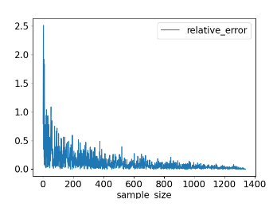

:PROPERTIES:
:ID:       0afb7034-f053-47d7-aea2-8d71eb45c627
:END:
#+title: Relative Error
#+filetags: :Statistics:

* Relative Errors
- To measure how accurate a measurement is compared to the true value.
- Relative errors: \(error\%=100\times\frac{|\mu-\bar{X_{i}}|}{\mu}\)
- Plotting on sample size
#+begin_src python
rel_error_pct = 100 * abs(pop_mean - sample_mean) / pop_mean

rel_errors.plot(x='sample_size', y='relative_error', kind='line')
plt.show()
#+end_src

