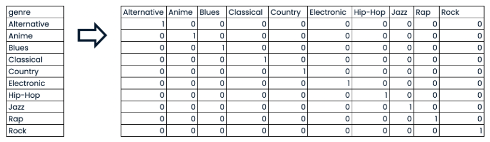

:PROPERTIES:
:ID:       f4ca75d9-362e-4d52-8e5c-0362c6882dc2
:END:
#+title: Scikit-Learn
#+filetags: :Python:ML:

* Design
** Consistency
*** Estimators
Any object that can estimate some parameters based on a dataset
is called an *estimator*. (e.g. an /imputer/)
- The estimation itself is performed by the ~fit()~ method
  - takes only datasets as parameters
- Any other parameters are hyperparameter, generally set via a constructor parameter.

*** Transformers
Some estimators can transform a dataset; they are called /transformers/.
- ~transformed = estimator.transform(input_dataset)~
- This transformation generally relies on the learned parameters.(~fit()~ results)
- Convenience method ~fit_transform()~

*** Predictors
Some estimators are capable of making predictions given a dataset; they are called predictors.
- ~predict()~ takes a dataset of new instances and returns a dataset of corresponding predictions.
- ~score()~ measures the quality of the predictions given a test set.

** Inspection
- All the estimator's hyperparameters are accessible directly via *public instance variables*
- All the estimator's learned parameters are accessible via *public instance variables with an underscore suffix*

** Nonproliferation of Classes
Datasets are represented as NumPy arrays or SciPy sparse matrices,
instead of homemade classes. Hyperparameters are just regular Python
strings or numbers.

** Composition
It is easy to create a Pipeline estimator from an arbitrary sequence of
transformers followed by a final estimator.

* General scikit-learn Workflow
#+begin_src python
from sklearn.module import Model

model = Model()
model.fit(X, y) # X: features, y: target variable
predictions = model.predict(X_new)
#+end_src

* Preprocessing Data
:PROPERTIES:
:ID:       41289401-f997-4222-97c6-60a729eb8234
:END:
- Numeric data
- No missing values

** Dealing with Categorical Features
- Converting to *dummy variables*
  - 0: Observation was NOT that category
  - 1: Observation was that category

- Can delete the last column "Rock"
  - If a song is not any of the first nine genres, then it is a rock song
  - If we don't delete it, we are duplicating information. might be an issue for some models
- Code:
  - scikit-learn: ~OneHotEncoder()~
  - pandas: ~get_dummies()~
#+begin_src python
# genre: categorical feature
# popularity: target variable
music_dummies = pd.get_dummies(music_df, columns=['genre'], drop_first=True)
#+end_src
