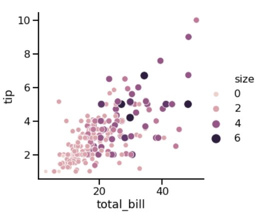
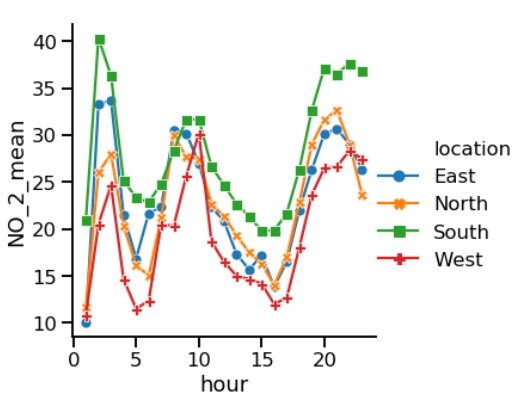

:PROPERTIES:
:ID:       f86e4126-bb1a-45f1-b9b7-b00c2d98672e
:END:
#+title: Seaborn
#+filetags: :DataScience:

* Overview
- Easy way to create the most common types of plots
- Works well with [[id:05ef9aaa-7fa2-45b4-9ed9-d8d01c8abff2][pandas]]
- Built on top of [[id:c78f636f-88e8-4cb8-8e28-0dc34bfbaf3a][matplotlib]]
- Samual Norman Seaborn (sns) from "The West Wing" TV show
  - ~import seaborn as sns~

* Simple Examples
#+begin_src python
import seaborn as sns
import matplotlib.pyplot as plt

sns.scatterplot(x='height', y='weight', data=df)
sns.countplot(x='gender', data=df) # bar plot
#+end_src

* hue
#+begin_src python
import pandas as pd
import seaborn as sns
tips = sns.load_dataset('tips')

hue_colors = {'Yes': 'black', 'No': 'red'}

sns.scatterplot(x='total_bill', y='tip',
                data=tips, hue='smoker',
                hue_order=['Yes', 'No'],
                palette=hue_colors)
#+end_src

* Relational Plots
** ~relplot()~
- Why use ~relplot()~ instead of ~scatterplot()~?
  - ~relplot()~ lets you create subplots in a single figure
#+begin_src python

sns.relplot(x='total_bill', y='tip', data=tips, kind='scatter',
            col="smoker", # separate plots by smoker
            row="time", # separate plots by time
            )
# useful options: col_wrap, col_order, row_order
#+end_src

** Scatter Plots
- Customizations:
  - Subplots (~col~ and ~row~)
  - Subplots with color (hue)
  - Subgroups with point size, style and transparency
  - Changing point transparency
*** Examples
- Point Size:
  - ~sns.relplot(x='total_bill', y='tip', data=tips, kind='scatter', size='size', hue='size')~
  

- Point Style
  - ~sns.relplot(x='total_bill', y='tip', data=tips, kind='scatter', hue='smoker', style='smoker')~
[[file:images/screenshots/Scatter_Plots/2024-11-09_22-45-42_screenshot.png]]
** Line Plots
#+begin_src python
sns.relplot(x='hour', y='NO_2_MEAN', data=air_df_loc_mean,
            kind='line', markers=True, dashes=False,
            hue='location', style='location', # subgroups by location
            )
#+end_src

- Multiple observations per x-value
  - ~sns.relplot(x='hour', y='NO_2', data=air_df, kind='line')~
  - Replacing CI with std: ~ci='sd'~
  - Turn off the CI: ~ci=None~
[[file:images/screenshots/Line_Plots/2024-11-09_22-56-40_screenshot.png]]
