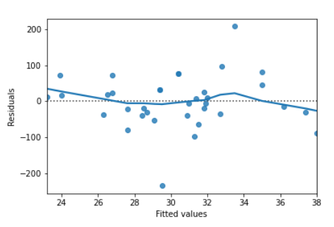
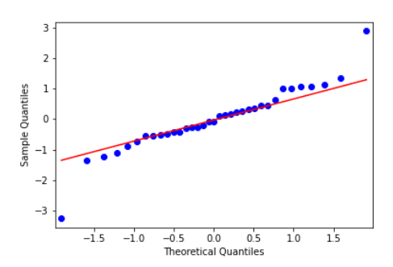
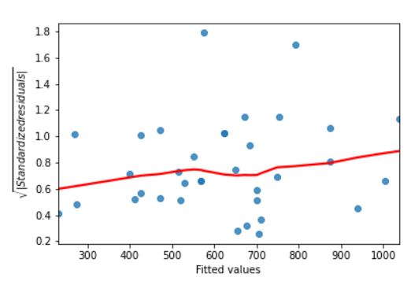

:PROPERTIES:
:ID:       ba10e7ca-778d-4e4b-8251-e398cf189a83
:END:
#+title: statsmodels
#+filetags: :Python:DataScience:

* Linear Regression
** Numerical Explanatory Variable
#+begin_src python
from statsmodels.formula.api import ols
price_vs_area = ols('price ~ area', data=df)
price_vs_area = price_vs_area.fit()

print(price_vs_area.params) # intercept and slope

#+end_src
- Explanatory variable: area
- Response variable: price

** Categorical Explanatory Variable
- Coefficients are just the means of each category
- Add ~+0~ so that no intercept is included in the model
#+begin_src python
mass_vs_species = ols('mass ~ species + 0', data=dat).fit()
print(mass_vs_species.params  )
#+end_src
- Categorical explanatory variable: species
- Response numerical variable: mass

** Making Predictions
#+begin_src python
price_vs_area = ols('price ~ area', data=house_data).fit()
explanatory_data = pd.DataFrame({'area': np.random.randint(50, 100, 20)})

# Simple way
response_data = price_vs_area.predict(explanatory_data)

# Predicting inside a DataFrame which contains both the explanatory and response variables
prediction_data = explanatory_data.assign(price=price_vs_area.predict(explanatory_data))
#+end_src
- Extrapolating :: means making predictions outside the range of observed data. *Can lead to misleading results!*

** Model Methods
- ~.params~
- ~.fittedvalues~: predictions on the original dataset
- ~.resid~: residuals -- actual response values minus predicted response values
  - equivalent to: ~df['actual'] - model.fittedvalues~
- ~.summary()~

** Quantifying Model Fit
*** R-squared (Coefficient of Determination)
- *r-squared* is the proportion of the variance in the response variable
  that is predictable from the explanatory variable
- ~.rsquared~
- *R-squared*: /more than one/ explanatory variable
- It's just correlation squared ~s1.corr(s2) ** 2~
- =1= means a perfect fit
- =0= means the worst possible fit

*** RSE (Residual Standard Error)
- A *typical* difference between a prediction and an observed response,
  i.e. How much the predictions are typically wrong.
- /same unit/ as the response variable
- Calculating RSE
#+begin_src python
# one way
rse = np.sqrt(model.mse_resid)

# another way
residuals_sq = model.resid ** 2
sum_of_residuals_sq = sum(residuals_sq)
degrees_of_freedom = len(df.index) - 2
rse = np.sqrt(sum_of_residuals_sq / degrees_of_freedom)
#+end_src

*** MSE (Mean Squared Error)
- \(MSE=\frac{1}{n}\sum_{i=1}^n(y_i, \hat{y}_i)^2\)
- ~model.mse_resid~

*** RMSE (Root Mean Squared Error)
- Measure RMSE in the same units at the target variable
- \(RMSE=\sqrt{MSE}\)
#+begin_src python
# one way
rse = np.sqrt(model.mse_resid)

# another way
residuals_sq = model.resid ** 2
sum_of_residuals_sq = sum(residuals_sq)
n_obs = len(df.index)
rmse = np.sqrt(sum_of_residuals_sq / n_obs)
#+end_src
- Should use RSE instead typically.

** Visualizing Model Fit
*** Residuals vs. Fitted
#+begin_src python
sns.residplot(x='height', y='mass', data=df,
              lowess=True, # lowess trend line, smooth curve following the data
              )
plt.xlabel('Height')
plt.ylabel('Residuals')
plt.show()
#+end_src

*** Q-Q Plot
It shows whether or not the residuals follow a *normal distribution*.
- x-axis: quantiles from the normal distribution
- y-axis: quantiles derived from the dataset
#+begin_src python
from statsmodels.api import qqplot
qqplot(data=model.resid,
       fit=True, # Compare to a normal distribution
       line='45', # 45-degree line
       )
#+end_src

*** Scale-location Plot
- Square root of the standardized residuals vs. Fitted
- Shows whether *the size of the residuals* (abs) gets bigger or smaller
#+begin_src python
# Preprocess
# Extract the normalized residuals from the model
model_norm_resid = model.get_influence().resid_studentized_internal

# Standardize the residuals
# Take the absolute value and the square root of the normalized residuals
model_norm_resid_std = np.sqrt(np.abs(model_norm_resid))

# Plot the residuals
sns.regplot(x=model.fittedvalues, y=model_norm_resid_std,
            ci=None, lowess=True)
#+end_src

* Outliers
** Leverage & Influence
- Leverage :: Measures how extreme the explanatory values are.
- Influence :: Measures how much the model would change if you left the observation out of the dataset when modeling.
#+begin_src python
model = ols('y ~ x', df).fit()
summary = model.get_influence().summary_frame()
df['leverage'] = summary['hat_diag'] # Indicates how extreme x is

# Cook's distance is the most common measure of influence
df['cooks_dist'] = summary['cooks_d'] # Indicates how extreme y is
df['cooks_dist'].sort_values(ascending=False).head() # Top 5 most influential points
#+end_src
- Removing the most influential rows

* Logistic Regression
- Variable to prediction should be numeric
#+begin_src python
from statsmodels.formula.api import logit

# Modeling
model = logit("y ~ x", data=df).fit()
print(model.params)

# Plotting
sns.regplot(x="x", y="y", data=df, logistic=True, ci=None)
plt.axline((0, model.params["Intercept"]), slope=model.params["x"], color='black')
plt.show()
#+end_src

** Making Predictions
#+begin_src python
explanatory_data = pd.DataFrame({'x': np.arange(10)})

prediction_data = explanatory_data.assign(
    y = model.predict(explanatory_data))
prediction_data['most_likely'] = np.round(prediction_data['prob']) # most likely value

sns.scatterplot(x='x', 'most_likely', data=prediction_data, color='red')
#+end_src
- Another way to talk about binary responses: *Odds ratios*
  - Commonly used in gambling
  - \(odds\_ratio=\frac{prob}{1-prob}\)
#+begin_src python
prediction_data['odds_ratio'] = prediction_data['prob'] / (1 - prediction_data['prob'])

# Visualize the odds ratio
sns.lineplot(x='x', y='odds_ratio', data=prediction_data)
plt.axhline(y=1, linestyle='dotted')

# prediction_data['log_odds_ratio'] = np.log(prediction_data['odds_ratio'])
# plt.yscale('log') # oodds ratio changes linearly with x
#+end_src
*** Comparing Scales
| Scale               | Values easy to understand? | Changes easy to understand? | Is precise? |
|---------------------+----------------------------+-----------------------------+-------------|
| Probability         | ✔️                        | ❌                          | ✔️         |
| Most likely outcome | ✔️✔️                      | ✔️                         | ❌          |
| Odd ratio           | ✔️                        | ❌                          | ✔️         |
| Log odd ratio       | ❌                         | ✔️                         | ✔️         |
- "Changes easy to interpret" means:
  - It's easy to reason about how changes in the explanatory variable will change the response.

** Quantifying Model Fit
*** Confusion Matrix
|              | predicted false | predicted true |
| actual false | correct         | false positive |
| actual true  | false negative  | correct        |
- Confusion matrix: the counts of each outcome
#+begin_src python
# manually calculate the confusion matrix
actual_response = churn['has_churned']
predicted_response = np.round(model.predict()) # predict() returns each observation's probability
outcomes = pd.DataFrame({'actual': actual_response, 'predicted': predicted_response})
print(outcomes.value_counts(sort=False))

# automatically calculate the confusion matrix
conf_matrix = model.pred_table()
# => array([[TN, FP],
#           [FN, TP]])
# TN = conf_matrix[0, 0]
# FP = conf_matrix[0, 1]
#+end_src
- Plotting Confusion Matrix
#+begin_src python
from statsmodels.graphics.mosaicplot import mosaic
mosaic(conf_matrix)
#+end_src

[[file:images/screenshots/Quantifying_Model_Fit/2024-12-08_10-05-39_screenshot.png]]

*** Metrics
- *Accuracy* is the proportion of correct predictions.

\[accuracy=\frac{TN+TP}{TN+FN+FP+TP}\]

- *Sensitivity* is the proportion of true positives.

\[sensitivity=\frac{TP}{FN+TP}\]

- *Specificity* is the proportion of true negatives.

\[specificity=\frac{TN}{TN+FP}\]

- There is often a *trade-off* between sensitivity and specificity.

* TODO Courses
- Intermediate Regression with ~statsmodels~ in Python
- Generalized Linear Models in Python
- Introduction to Predictive Analytics in Python
- Linear Classifiers in Python
