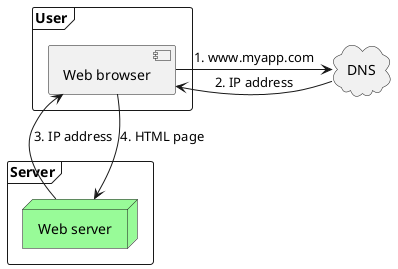
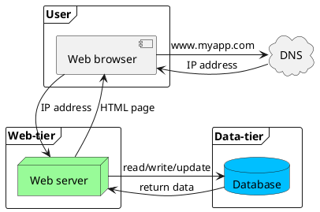
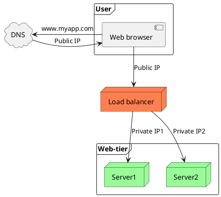

:PROPERTIES:
:ID:       bed8b081-8910-4309-9aa5-b4fc5179b0ef
:END:
#+title: System Design Interview
#+filetags: :Interview:SystemDesign:

* Web Application Design
** Single Server Setup
#+begin_src plantuml :file puml/SystemDesign/single_server.png
@startuml
frame Server {
    Node "Web server" as webserver #palegreen
}
frame User {
    component "Web browser" as browser
}
cloud DNS
webserver -u-> browser : 3. IP address
webserver <-u- browser : 4. HTML page

browser -r-> DNS : 1. www.myapp.com
browser <-r- DNS : 2. IP address
@enduml
#+end_src

#+RESULTS:

** Adding Data Tier
#+begin_src plantuml :file puml/SystemDesign/single_srv_db.png
@startuml
frame "Web-tier" {
    Node "Web server" as webserver #palegreen
}

frame User {
    component "Web browser" as browser
}
cloud DNS
browser -> DNS : www.myapp.com
browser <- DNS : IP address

browser -d-> webserver : IP address
webserver -u-> browser  : HTML page

frame "Data-tier" {
    database "Database" as db #DeepSkyBlue
}
webserver -> db : read/write/update
webserver <- db : return data
@enduml
#+end_src

#+RESULTS:

*** Choose DB
- Relational Databases: can perform JOIN operations
- NoSQL Databases
  - key-value stores
  - graph stores
  - column stores
  - document stores
- The reasons to choose non-relational databases
  - requires super-low latency
  - data are unstructured, or do not have any relational data
  - need to store a massive amount of data
** Adding Load Balancer
A load balancer evenly distributes incoming traffic among web servers.
- It also solved no *failover* issue, improving the availability of the *web tier*
- Web tier replication
#+begin_src plantuml :file puml/SystemDesign/loadbalancer.png
@startuml
Node "Load balancer" as balancer #Coral
frame "Web-tier" {
    Node Server1 #palegreen
    Node Server2 #palegreen
}
frame User {
    component "Web browser" as browser
}
cloud DNS
browser -d-> balancer : Public IP
balancer -d-> Server1 : Private IP1
balancer -d-> Server2 : Private IP2

browser -l-> DNS : www.myapp.com
browser <-l- DNS : Public IP
@enduml
#+end_src

#+RESULTS:

** Database Replication
- Master/Slave Pattern
  - Master generally only supports *write* operations.
  - Slave only supports read operations.
  - Most applications require a much higher ratio of reads to writes(more slaves)
- Advantages of Replication:
  - Better read performance: slaves can be freely added
  - Reliability: many copies
  - High availability: slave can be promoted to the new master
    - Slave might not be up to date
    - usually need to run *data recovery scripts* to fill the missing data
** Adding Cache Tier
