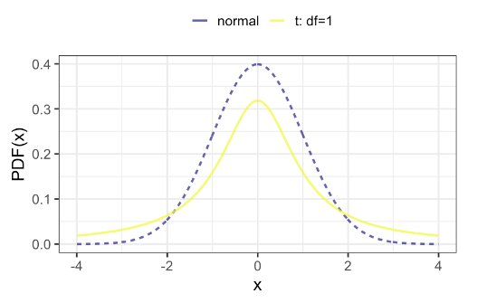

:PROPERTIES:
:ID:       1bf89458-2878-4fbf-a0b9-9a59a8fdc486
:END:
#+title: T-Distribution
#+filetags: :Statistics:

* Overview
- Have a parameter named degrees of freedom (DF)
- Look like a normal distributions, with fatter tails

* Degrees of Freedom
- Larger degrees of freedom -> gets closer to the normal
  - Normal distribution == t-distribution with infinite DF
- What is DF? maximum number of logically independent values in the data sample.
- [[id:80cef9fb-e3b0-4903-85a9-ca96efd96428][Degrees of Freedom Concept]]
