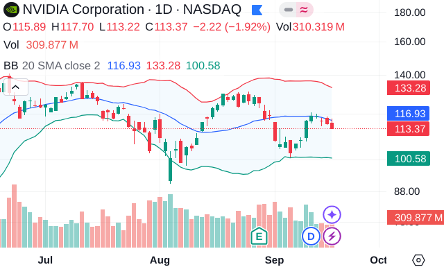
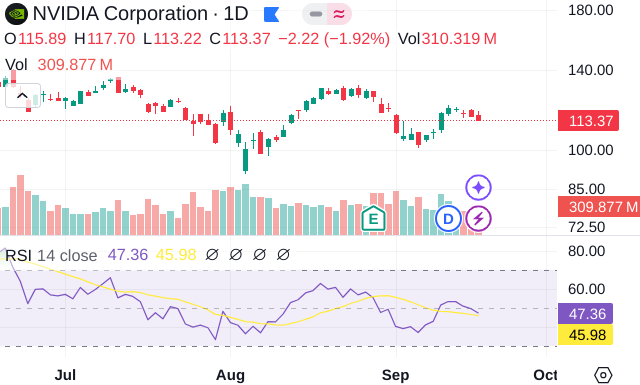
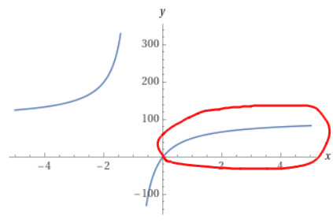
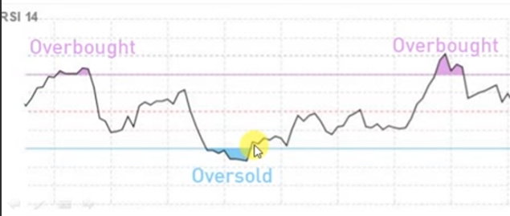
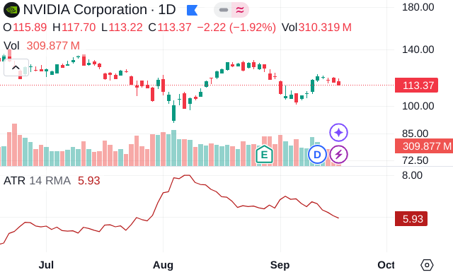
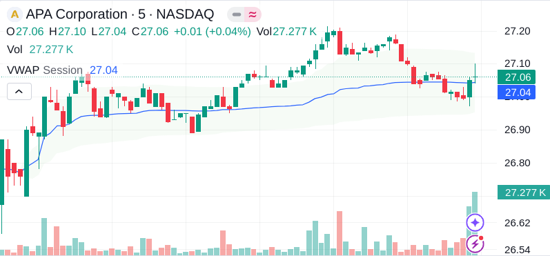

:PROPERTIES:
:ID:       3b0a02bb-593b-43a1-808c-f63764ae13a2
:END:
#+title: TA Indicators
#+filetags: :Trading:TA:

* Tips
- Different indicators have to be used:
  - for specific type of strategies
  - for specific type of stock

* Popular Indicators
** Bollinger Bands

- For mean reversion strategies.
- Default: 20 days, \(2\sigma\), SMA/EMA

** RSI

- Relative Strength Indicator
- For mean reversion strategies.
- Range from 0 to 100
  - The higher the number means the bigger the green candles compare to red ones.
  - Overbought: close to 100
  - Underbought: close to 0
- \(RSI=100-\frac{100}{1+RS}\)
  - RS: Relative Strength, \(RS=\frac{Average Gain}{Average Loss}\)
- Default: 14 days

*** Formula Explaination

- The large RS means average gain is way more than average loss.

*** Entry Point

- For a buy signal is when the RSI drops below 30 and then rises back above it
- For a sell signal is when the RSI rises above 70 and then drop back below it.

** ATR

- Average True Range
- Shows us the average amount that a stock moves in a day in currency value.
- The indicator shows how far the trend is likely to continue.
  - *Can be used to set stop-loss or take-profit.*

** VWAP
The VWAP is used by institutions to benchmark their execution price throughout a period.
- For example, traders wouldn't like to buy/sell stocks with a price above/below VWAP.
- Suitable for high institutional ownership.
- Only be able to used on intraday data.
- An indicator can be used to pick entry points.

