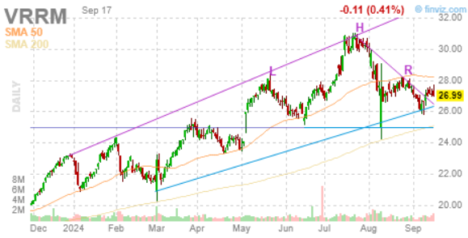
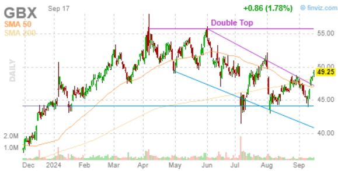
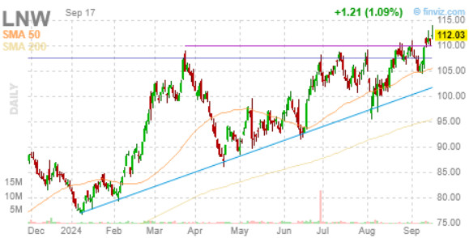
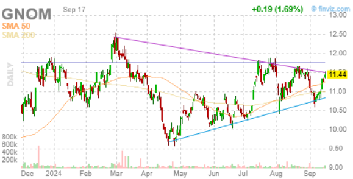
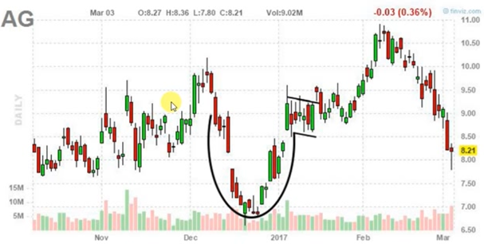
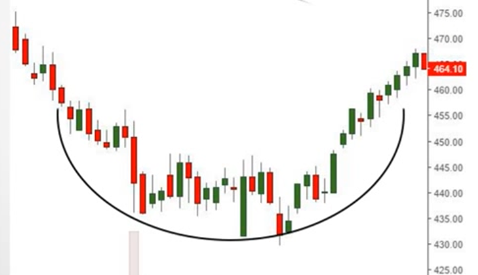

:PROPERTIES:
:ID:       dc806d70-20e1-40fa-81cd-9f2c7f660107
:END:
#+title: TA Patterns
#+filetags: :Trading:TA:

* Head and Shoulders

- Terms: head, shoulder, neckline
- self fulfilling
** Entry Point
** Stop-Loss
** Profit Target

* Top and Bottom
** Double Top

- Meaningful: Probably a big seller at double top line.
- Meaning more in short-term, especially for intraday.
*** Entry Point
*** Stop-Loss
*** Profit Target
** Variants
- Multiple Top
- Double Bottom
- Multiple Bottom

* Triangles
** Ascending Triangle

- Meaningful: buyers became aggressive
- Volume: Look for increasing volume on the breakout above the resistance line.
  - This adds validity to the breakout and suggests strong buying momentum.
- Time frame: The reliability of the pattern tends to increase with longer time frames.

*** Entry Point
- Entering a long position when the price breaks *above the horizontal resistance line* on *increased volume*.
  - Logic: when price break above the resistance line, stop-loss orders from sellers will push the price up.

*** Stop-Loss
- Can be placed just below the last low within the triangle or just below the rising trendline.

*** Profit Target
?

*** Variants
- Descending Triangle

** Wedge (Regular Triangle)

*** Variants
- Wedge Up
- Wedge Down

* Cup and Handle

1. Drops slower and slower and then picks up faster and faster
2. It reconciliates and then breaks up

* Rounding Bottom

