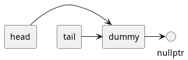
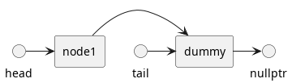
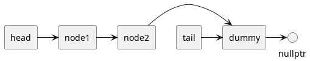

:PROPERTIES:
:ID:       7f7c8750-1a2d-4a09-b008-e999dd17784d
:END:
#+title: Thread-safe Queue
#+filetags: C++

- links :: [[id:890f2b58-21c3-48b7-a975-c532eedc01ec][Condition Variable]]
* Lock-based
** Using Locks and Condition Variables

#+begin_src c++
  #include <condition_variable>
  #include <memory>
  #include <mutex>
  #include <queue>

  template <typename T>
  class threadsafe_queue {
  private:
    mutable std::mutex mut; // locking mutex in 'bool empty() const' is a mutating operation.
    std::queue<T> data_queue;
    std::condition_variable data_cond;

  public:
    threadsafe_queue() {}

    threadsafe_queue(threadsafe_queue const &) = delete;

    void push(T new_value) {
      std::lock_guard<std::mutex> lk(mut);
      data_queue.push(std::move(new_value));
      data_cond.notify_one();
    }

    void wait_and_pop(T &value) {
      std::unique_lock<std::mutex> lk(mut);
      data_cond.wait(lk, [this] { return !data_queue.empty(); });
      value = std::move(data_queue.front());
      data_queue.pop();
    }

    std::shared_ptr<T> wait_and_pop() {
      std::unique_lock<std::mutex> lk(mut);
      data_cond.wait(lk, [this] { return !data_queue.empty(); });
      std::shared_ptr<T> res(std::make_shared<T>(data_queue.front()));
      data_queue.pop();
      return res;
    }

    bool try_pop(T &value) {
      std::lock_guard<std::mutex> lk(mut);
      if (data_queue.empty())
        return false;
      value = std::move(data_queue.front());
      data_queue.pop();
      return true;
    }

    std::shared_ptr<T> try_pop() {
      std::lock_guard<std::mutex> lk(mut);
      if (data_queue.empty())
        return std::shared_ptr<T>();
      std::shared_ptr<T> res(std::make_shared<T>(data_queue.front()));
      data_queue.pop();
      return res;
    }

    bool empty() const {
      std::lock_guard<std::mutex> lk(mut);
      return data_queue.empty();
    }
  };
#+end_src

** Holding ~std::shared_ptr<>~ instances
#+begin_src c++
template<typename T>
class threadsafe_queue {
private:
  mutable std::mutex mut;
  std::queue<std::shared_ptr<T> > data_queue;
  std::condition_variable data_cond;

public:
  threadsafe_queue() {}

  void wait_and_pop(T& value) {
    std::unique_lock<std::mutex> lk(mut);
    data_cond.wait(lk, [this]{return !data_queue.empty();});
    value = std::move(*data_queue.front());
    data_queue.pop();
  }

  bool try_pop(T& value) {
    std::lock_guard<std::mutex> lk(mut);
    if(data_queue.empty())
      return false;
    value = std::move(*data_queue.front());
    data_queue.pop();
    return true;
  }

  std::shared_ptr<T> wait_and_pop() {
    std::unique_lock<std::mutex> lk(mut);
    data_cond.wait(lk, [this]{return !data_queue.empty();});
    std::shared_ptr<T> res = data_queue.front();
    data_queue.pop();
    return res;
  }

  std::shared_ptr<T> try_pop() {
    std::lock_guard<std::mutex> lk(mut);
    if(data_queue.empty())
      return std::shared_ptr<T>();
    std::shared_ptr<T> res = data_queue.front();
    data_queue.pop();
    return res;
  }

  void push(T new_value) {
    std::shared_ptr<T> data(
      std::make_shared<T>(std::move(new_value)));
    std::lock_guard<std::mutex> lk(mut);
    data_queue.push(data);
    data_cond.notify_one();
  }

  bool empty() const {
    std::lock_guard<std::mutex> lk(mut);
    return data_queue.empty();
  }
};
#+end_src
- If the data is held by ~std::shared_ptr<>~, *the allocation of the new instance* can now be done *outside the lock* in ~push()~
  - allocation is typically an expensive operation

** Using Fine-grained Locks
#+begin_src plantuml :file images/Thread-Safe_Queue/no_elem.png
@startuml
circle nullptr
circle head
rectangle dummy
circle tail

head -> dummy
tail -> dummy
dummy -> nullptr
@enduml
#+end_src

#+RESULTS:

#+begin_src plantuml :file images/Thread-Safe_Queue/one_elem.png
circle nullptr

circle head
rectangle node1
rectangle dummy
circle tail

head -> node1
node1 -> dummy
tail -> dummy
dummy -> nullptr
#+end_src

#+RESULTS:

#+begin_src plantuml :file images/Thread-Safe_Queue/two_elem.png
circle nullptr

circle head
rectangle node1
rectangle node2
rectangle dummy
circle tail

head -> node1
node1 -> node2
node2 -> dummy
tail -> dummy
dummy -> nullptr
#+end_src

#+RESULTS:

#+begin_src c++
#include <mutex>
#include <queue>
#include <memory>

// head==tail implies an empty list
// A single element list has head->next==tail
// x->next==tail implies x is the last element in the list
template <typename T> class threadsafe_queue {
private:
  struct node {
    std::shared_ptr<T> data;
    std::unique_ptr<node> next;
  };
  std::mutex head_mutex;
  std::unique_ptr<node> head;
  std::mutex tail_mutex;
  node *tail;

  node *get_tail() {
    std::lock_guard<std::mutex> tail_lock(tail_mutex);
    return tail;
  }

  std::unique_ptr<node> pop_head() {
    // lock the mutex on head and hold it until you're finished with head
    std::lock_guard<std::mutex> head_lock(head_mutex);
    // check if the queue is empty
    // by comparing head with tail, rather than checking for nullptr

    // also note, the head_lock is held and the tail_lock is also held in get_tail()
    if (head.get() == get_tail()) {
      return nullptr;
    }
    std::unique_ptr<node> old_head = std::move(head);
    head = std::move(old_head->next);
    return old_head;
  }
public:
  // Initially, head -> dummy, tail -> dummy
  threadsafe_queue() : head(new node), tail(head.get()) {}
  threadsafe_queue(const threadsafe_queue &other) = delete;
  threadsafe_queue &operator=(const threadsafe_queue &other) = delete;

  std::shared_ptr<T> try_pop() {
    std::unique_ptr<node> old_head = pop_head();
    // head_lock doesn't need to be locked when you return the result
    return old_head ? old_head->data : std::shared_ptr<T>();
  }

  void push(T new_value) {
    // If allocations fails, value may not be pushed
    // but the queue will remain in a valid state
    std::shared_ptr<T> new_data(std::make_shared<T>(std::move(new_value)));

    // new dummy
    std::unique_ptr<node> new_dummy(new node);
    node *const new_tail = new_dummy.get();

    // push() accesses only tail
    std::lock_guard<std::mutex> tail_lock(tail_mutex);
    // Data moves to old dummy, tail is the old dummy
    // So that there's no need to change the previous tail node
    auto old_dummy = tail; // just for readability
    old_dummy->data = new_data;
    old_dummy->next = std::move(new_dummy); // point to new dummy
    tail = new_tail; // update tail -> new dummy
  }

};
#+end_src
- The call to ~get_tail()~ locks the same mutex as the call to ~push()~,
there's a defined order between the two calls.
- It's important that the call to ~get_tail()~ occurs inside the lock on ~head_
mutex~.

*** Exceptions Handling
- In ~try_pop()~
  - Only operations that can throw exceptions are the mutex locks, and the data isn't modified until locks are acquired
  - Therefore ~try_pop()~ is exception-safe
- In ~push()~
  - Allocations might throw an exception.
  - But once the lock is acquired, none of the remaining operations can throw an exception.
  - ~push()~ is exception-safe
  - But the value
