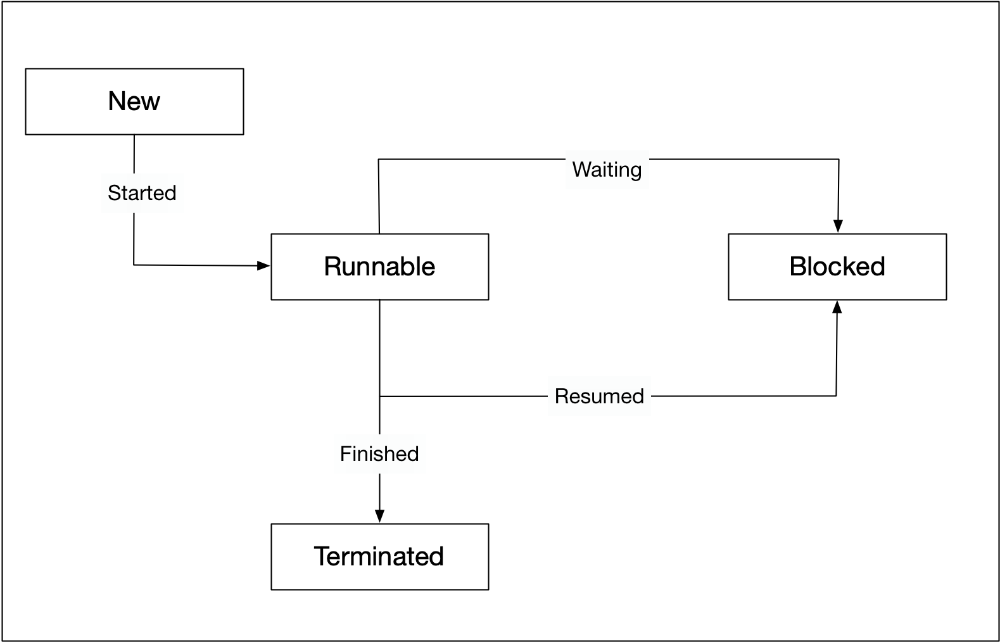

:PROPERTIES:
:ID:       d63d5c4d-c88c-426b-8166-ff39e8bf15d9
:END:
#+title: Threads
#+filetags: Linux

* Compare to Processes
- The creation of a thread is up to 100 times faster than the creation of a process
  - A thread does not require a new address space to be created
- Threads share their resources
  - All the threads in a process can access its shared memory
  - Threads also share other OS dependent resources such as processors, files, and network connections.
- The management overhead for threads is typically less than for processes
  - As a result, context switching is fast.

* State Diagram

#+DOWNLOADED: screenshot @ 2024-02-19 09:00:00

- New :: A thread is in this state once it has been created. Until it is actually running, it will not take any CPU resources.
- Runnable :: In this state, a thread might actually be running or it might be ready to run at any instant of time. It is the responsibility of the thread scheduler to assign CPU time to the thread.
- Blocked :: A thread might be in this state, when it is waiting for I/O operations to complete. When blocked, a thread cannot continue its execution any further until it is moved to the runnable state again. The thread scheduler is responsible for reactivating the thread.
