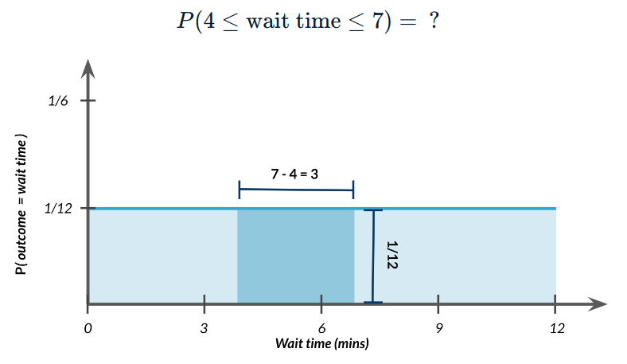

:PROPERTIES:
:ID:       41fc96ca-d4b5-44fc-ad46-c8783a7253ff
:ROAM_ALIASES: "Continious Uniform Distribution"
:END:
#+title: Uniform Distribution(C)
#+filetags: :Probability:Statistics:Math:

* Examples
** Wait Time
- Bus interval 12 mins

#+begin_src python
from scipy.stats import uniform

# Wait time 4-7 minutes for 12 minutes interval
prob = uniform.cdf(7, 0, 12) - uniform.cdf(4, 0, 12)
#+end_src
