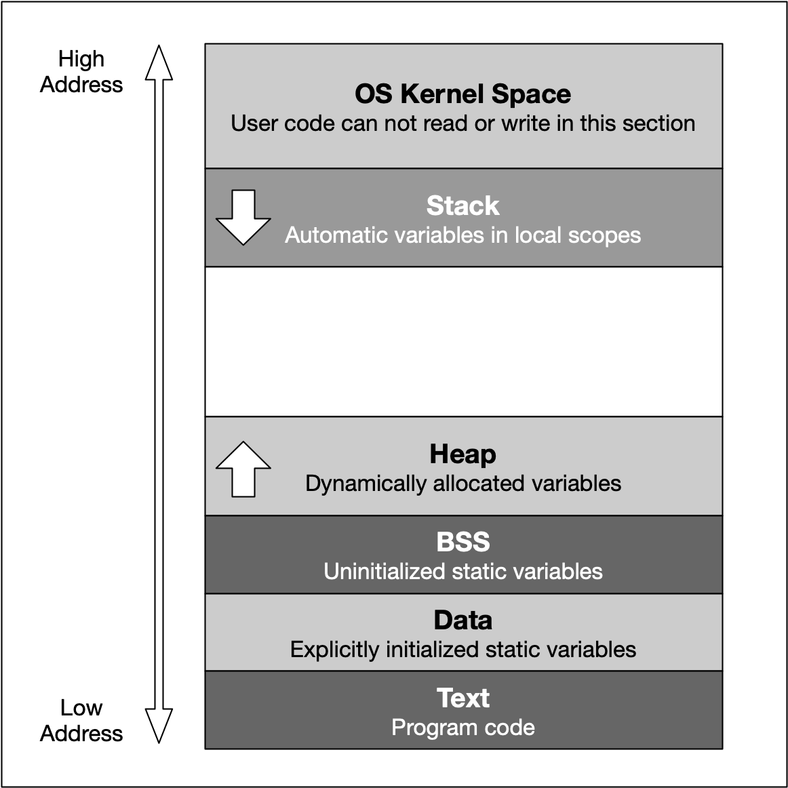

:PROPERTIES:
:ID:       4dc805d4-c007-4526-bd64-c9ca9af200a4
:END:
#+title: Virtual Memory
#+filetags: :OS:Linux:

- 只有内核才可以直接访问物理内存。

* Idea
The basic idea of virtual memory is to separate the addresses a program may use from the addresses in physical computer memory.
By using a mapping function, an access to (virtual) program memory can be redirected to a real address which is guaranteed to
be protected from other programs.

* 虚拟地址空间
Linux 内核给每个进程都提供了一个独立的虚拟地址空间，并且这个地址空间是连续的。这样，进程就可以很方便地访问内存，更确切地说是访问虚拟内存。
所有进程的虚拟内存加起来要比实际的物理内存大得多。所以，并不是所有的虚拟内存都会分配物理内存，只有那些实际使用的虚拟内存才分配物理内存。
分配后的物理内存，是通过内存映射来管理的。
[[../assets/Linux/VirtualMemory_1.png]]
- 虚拟地址空间的内部又被分为内核空间和用户空间两部分。
  - 进程在用户态时，只能访问用户空间内存；只有进入内核态后，才可以访问内核空间内存。

* 内存映射
[[../assets/Linux/VirtualMemory_2.png]]
- 页表实际上存储在 CPU 的内存管理单元 MMU 中，正常情况下，处理器就可以直接找出要访问的内存。
  - 而当进程访问的虚拟地址在页表中查不到时，系统会产生一个缺页异常。
  - MMU 规定了内存管理最小单位——页，通常是 4KB 大小。
  - Linux 通过多级页表（四级页表）来管理内存项，将原来的映射关系改成区块索引和区块内的偏移。
- TLB（Translation Lookaside Buffer) 是 MMU 中页表的高速缓存。
  - 通过减少进程的上下文切换，减少 TLB 的刷新次数，就可以提高 TLB 缓存的使用率，进而提高 CPU 的内存访问性能。

* 虚拟内存空间分布
[[../assets/Linux/VirtualMemory_3.png]]

#+DOWNLOADED: screenshot @ 2024-01-30 12:21:32

- 只读段：包括代码和常量等(Text+Data)
- 数据段：包括全局变量等。(BSS)
- 堆：包括动态分配的内存，从低地址开始向上增长。
- 文件映射段：包括动态库、共享内存等，从高地址开始向下增长。
- 栈：包括局部变量和函数调用的上下文等。栈大小固定，一般是 8MB。
