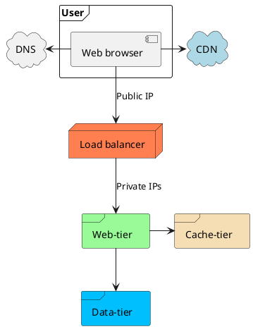
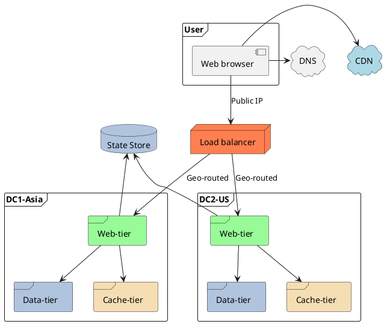
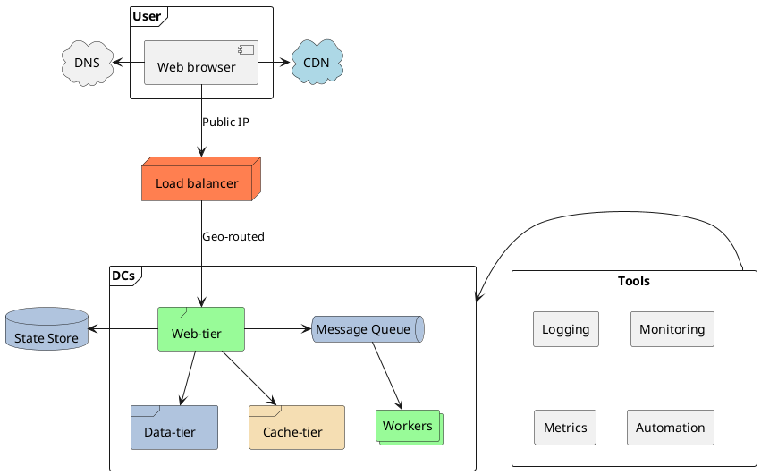

:PROPERTIES:
:ID:       66b1a5a2-36a4-4421-8edc-a470ec0e2292
:END:
#+title: Web Application Design
#+filetags: :Interview:SystemDesign:

* Single Server Setup
#+begin_src plantuml :file puml/SystemDesign/single_server.png
@startuml
frame Server {
    Node "Web server" as webserver #palegreen
}
frame User {
    component "Web browser" as browser
}
cloud DNS
webserver -u-> browser : 3. IP address
webserver <-u- browser : 4. HTML page

browser -r-> DNS : 1. www.myapp.com
browser <-r- DNS : 2. IP address
@enduml
#+end_src

#+RESULTS:
[[file:puml/SystemDesign/single_server.png]]

* Adding Data Tier
#+begin_src plantuml :file puml/SystemDesign/single_srv_db.png
@startuml
frame "Web-tier" {
    Node "Web server" as webserver #palegreen
}

frame User {
    component "Web browser" as browser
}
cloud DNS
browser -> DNS : www.myapp.com
browser <- DNS : IP address

browser -d-> webserver : IP address
webserver -u-> browser  : HTML page

frame "Data-tier" {
    database "Database" as db #LightSteelBlue
}
webserver -> db : read/write/update
webserver <- db : return data
@enduml
#+end_src

#+RESULTS:
[[file:puml/SystemDesign/single_srv_db.png]]
** Choose DB
- Relational Databases: can perform JOIN operations
- NoSQL Databases
  - key-value stores
  - graph stores
  - column stores
  - document stores
- The reasons to choose non-relational databases
  - requires super-low latency
  - data are unstructured, or do not have any relational data
  - need to store a massive amount of data
* Adding Load Balancer
A load balancer evenly distributes incoming traffic among web servers.
- It also solved no *failover* issue, improving the availability of the *web tier*
- Web tier replication
#+begin_src plantuml :file puml/SystemDesign/loadbalancer.png
@startuml
Node "Load balancer" as balancer #Coral
frame "Web-tier" {
    Node Server1 #palegreen
    Node Server2 #palegreen
}
frame User {
    component "Web browser" as browser
}
cloud DNS
browser -d-> balancer : Public IP
balancer -d-> Server1 : Private IP1
balancer -d-> Server2 : Private IP2

browser -l-> DNS : www.myapp.com
browser <-l- DNS : Public IP
@enduml
#+end_src

#+RESULTS:
[[file:puml/SystemDesign/loadbalancer.png]]
* Database Replication
- Master/Slave Pattern
  - Master generally only supports *write* operations.
  - Slave only supports read operations.
  - Most applications require a much higher ratio of reads to writes(more slaves)
- Advantages of Replication:
  - Better read performance: slaves can be freely added
  - Reliability: many copies
  - High availability: slave can be promoted to the new master
    - Slave might not be up to date
    - usually need to run *data recovery scripts* to fill the missing data

* [[id:3f815adf-8a11-42cd-8eed-94ee7d2b46b9][Database Sharding]]
* Adding Cache Tier
Temporary data store layer
** Considerations for Using Cache
- When to use cache?
  - Consider using cache when data is read frequently but modified infrequently
- Expiration policy
- Consistency: keeping the data store and the cache in sync
- Avoid SPOF(single point of failure): multiple cache servers
- Eviction policy: LRU(recently), LFU(frequently), FIFO

** Cache Strategies
- Read-through: ideal for scenarios where cache hits are frequent and predictable.
- Write-through: data is written to both the cache and the underlying data store simultaneously
- Write-behind(write-back): writing to the database is delayed
- Cache-aside(lazy loading): application checks cache miss and loads data from database

* Using CDN
Static content cache
#+begin_src plantuml :file puml/SystemDesign/web_with_cache.png
@startuml
Node "Load balancer" as balancer #Coral
frame "Web-tier" as web #palegreen
frame User {
    component "Web browser" as browser
}
cloud DNS
browser -d-> balancer : Public IP
balancer -d-> web : Private IPs

browser -l-> DNS

cloud CDN #lightblue
browser -r-> CDN

frame "Data-tier" as data #LightSteelBlue
frame "Cache-tier" as cache #Wheat

web -> cache
web --> data
@enduml
#+end_src

#+RESULTS:

** Considerations of Using a CDN
- Cost
- Appropriate cache expiry
- CDN fallback: clients should be able to detect CDN outage and request from the origin
- Invalidating files: using APIs provided by CDN vendors
  - Use versioning like ~image.png?v=2~ in the URL
* Stateless Web Tier
Move state (user session data) out of the web tier.
- Store session data in the persistent storage(NoSQL for easy to scale)
- Auto-scaling of the web tier will be easily achieved.

** Stateful Design
- Load balancers always routes User A's requests to the Server 1
  - Problem: Adding/removing servers, handling server failures are quite difficult.
* Multiple Data Centers
#+begin_src plantuml :file puml/SystemDesign/web_multi_dc.png
@startuml
frame User {
    component "Web browser" as browser
}
Node "Load balancer" as balancer #Coral

cloud DNS
browser -d-> balancer : Public IP
browser -l-> DNS

cloud CDN #lightblue
browser -r-> CDN

frame "DC1-Asia" as asia {
    frame "Web-tier" as w1 #palegreen
    frame "Data-tier" as d1 #LightSteelBlue
    frame "Cache-tier" as c1 #Wheat
    w1 -d-> d1
    w1 -d-> c1
}
frame "DC2-US" as us {
    frame "Web-tier" as w2 #palegreen
    frame "Data-tier" as d2 #LightSteelBlue
    frame "Cache-tier" as c2  #Wheat
    w2 -d-> d2
    w2 -d-> c2
}
database "State Store" as state #LightSteelBlue
w1 -u-> state
w2 -u-> state

balancer -d-> w1 : "Geo-routed"
balancer -d-> w2 : "Geo-routed"
@enduml
#+end_src

#+RESULTS:

** Considerations
- Traffic redirection
  - GeoDNS can be used to direct traffic to the nearest data center depending on where a user is located.
- Data synchronization: multi-datacenter replication (asynchronous)
- Test and deployment: automated deployment are vital to keep services consistent.

* Message Queue
To further scale the system, we need to decouple *different components* of the system(web tier), so they can be scaled independently.

* Logging, Metrics, Automation
** Logging
Monitoring error logs
- aggregate to a centralized service for easy search and viewing.

** Metrics
Collecting different types of metrics help us to:
- gain business insights
- understand the health status of the system

Useful metrics:
- Host level metrics: CPU, Memory, disk I/O, etc.
- Aggregated level metrics: data tier, cache tier
- *Key business metrics*: daily active users, retention, revenue, etc.

** Automation
- CI/CD
* Final Architecture
#+begin_src plantuml :file puml/SystemDesign/web_final.png
@startuml
frame User {
    component "Web browser" as browser
}
Node "Load balancer" as balancer #Coral

cloud DNS
browser -d-> balancer : Public IP
browser -l-> DNS

cloud CDN #lightblue
browser -r-> CDN
frame "DCs" as dc {
    frame "Web-tier" as wt #palegreen
    frame "Data-tier" as dt #LightSteelBlue
    frame "Cache-tier" as ct #Wheat
    queue "Message Queue" as mq #LightSteelBlue
    collections "Workers" as wk #palegreen
    wt -r-> mq
    mq -d-> wk
    wt -d-> dt
    wt -d-> ct
}
database "State Store" as state #LightSteelBlue
wt -l-> state

balancer -d-> wt : "Geo-routed"

rectangle "Tools" as tools {
    rectangle "Logging" as log
    rectangle "Monitoring" as monitor
    rectangle "Metrics" as metrics
    rectangle "Automation" as auto
}
tools -l-> dc
@enduml
#+end_src

#+RESULTS:

* Millions of Users Key Design
- Keep web tier *stateless*
- Build redundancy at every tier
- Cache data as much as you can
- Host static assets in CDN
- Support multiple data centers
- Scale your data tier by sharding
- Split tiers into individual services (using message queue)
- Monitor your system and use automation tools
