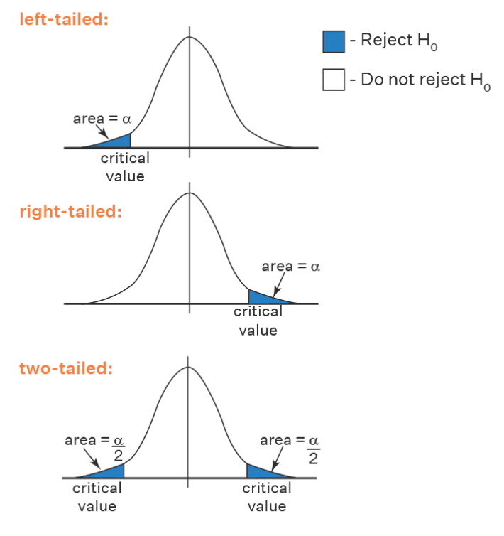

:PROPERTIES:
:ID:       3c158478-8d52-4fa3-9262-f0267d6c48c8
:END:
#+title: Z-Test
#+filetags: :Statistics:Python:

* Overview
A Z-Test is a statistical test:
- Conduct on data that approximately *follows a normal distribution*.

Z-Test can be performed on
- one sample (sample statistics over hypothesis)
- two samples (two sample statistics)
- proportions

Z-Test can further be classified into
- left-tailed
- right-tailed
- two-tailed

* Steps
1. State hypotheses\(H_{0}\), \(H_{a}\) and identify the claim
2. Find critical value/s
3. Compute test value by using Z-Test
4. Make decision to reject or to not reject the \(H_{0}\)

* One Sample Z-Test
To compare one mean to a hypothesized value when
- The variances are known (use *bootstrapping*)
- The sample size is large (\(n\ge30\))
- z-score: \(z=\frac{SampStat-HypothValue}{StdError}\)
  - *Standardized Value*
  - Then can utilize the z-table (standard normal distribution table) [[id:e671c7ff-b03d-47a3-aa8a-91277e0e80c3][Z-Distribution]]

** Left-tailed
- Null hypothesis: \(H_{0}\): \(\mu=\mu_{0}\)
- Alternate hypothesis: \(H_{a}\): \(\mu<\mu_{0}\)
- Decision Criteria: reject the \(H_{0}\) if the z statistic < z critical value

** Right-tailed
- Null hypothesis: \(H_{0}\): \(\mu=\mu_{0}\)
- Alternate hypothesis: \(H_{a}\): \(\mu>\mu_{0}\)
- Decision Criteria: reject the \(H_{0}\) if the z statistic > z critical value

** Two-tailed
- Null hypothesis: \(H_{0}\): \(\mu=\mu_{0}\)
- Alternate hypothesis: \(H_{a}\): \(\mu\ne\mu_{0}\)
- Decision Criteria: reject the \(H_{0}\) if the z statistic > z critical value

* Two Sample Z-Test
\[z=\frac{(\bar{X_{1}}-\bar{X_{2}})-(\mu_{1}-\mu_{2})}{\sqrt{\frac{\sigma_{1}^{2}}{n_{1}}+\frac{\sigma_{2}^{2}}{n_{2}}}}\]
- Two-tailed: \(H_{0}\): \(\mu_{1}=\mu_2\)

* Proportion Z-Test
** One Proportion Z-Test
A one proportion z-test is used when there are two groups and compares the value of an observed proportion to a theoretical one.
\[z=\frac{p-p_{0}}{\sqrt{\frac{p_{o}(1-p_{0})}{n}}}\]
- \(p\) is the observed value of the proportion
- \(p_{0}\) is the theoretical proportion value
- \(n\) is the sample size

The null hypothesis is that the two proportions are the same

** Two Proportion Z-Test
** [[https://www.cuemath.com/data/z-test/][Reference]]

* Examples
**  One Sample Two-tailed
Stack Overflow Survey
- Hypothesis: The mean annual compensation of the population of data scientists is $110000

#+begin_src python
import numpy as np

# sample series: stack_overflow['converted_comp']

hypothesis = 110000
sample_mean = stack_overflow['converted_comp'].mean()

# bootstrapping
boot_distn = []
for _ in range(5000):
    boot_distn.append(
        np.mean(stack_overflow.sample(frac=1, replace=True)['converted_comp'])
    )

# plotting
plt.hist(boot_distn, bins=50)
plt.show()

# standard error
std_error = np.std(boot_distn, ddof=1)

# z-score
z_score = (sample_mean - hypothesis) / std_error
#+end_src
