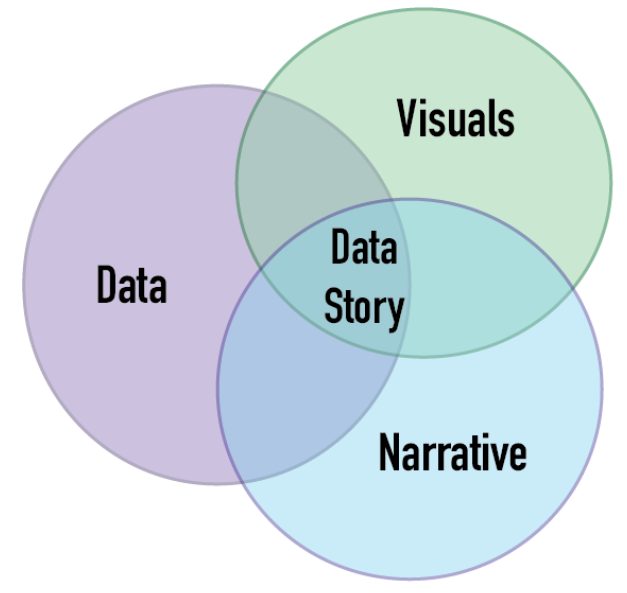

:PROPERTIES:
:ID:       6eed31dd-a6eb-41f6-95b5-6125b86b3536
:ROAM_ALIASES: "Data Storytelling"
:END:
#+title: Data Reporting
#+filetags: :DataScience:

* Fundamentals of Storytelling
** Definition
Data storytelling is the practice of building a narrative around a set of data and
its accompanying visualizations to help convey the meaning of that data in a powerful
and compelling fashion.
- Anecdotes = *imagination*
- Stories = *memorable*
- *Actionable* insights

** Benefits
- Helps focus attention
- Meaning and providing context (add value)
- Helps retain insights
- Better-informed decision-making
- Persuade change-resistant(change-adverse) stakeholders

** Effective Storytelling
- *3-minute story*: what would we focus on if we only had three minutes to tell a story.
- *Big idea*: in one sentence
- *Prioritize* essential points

* Process
  [[file:images/screenshots/Fundamentals_of_Storytelling/2024-12-02_09-36-25_screenshot.png]]

** Translating Technical Results
Should be
- Easy to understand
- Engage audience
- Decision-making
- Drive change
- Strategies

*** Audience Awareness
- What do they know? (backgrounds) -> Adjust content
- What do they need to understand? -> Be conversational
- What level of information do they need? -> Serve audience

*** ADEPT
- Analogy
- Diagram
- Example
- Plain english
- Technical definition

*** Focus on Impact
Instead of process, focus on impact, e.g.
- *Instead*: Use a non-relational database to make efficient nested queries.
- *Focus*: Changing the storage approach will save a lot of time.
* Audiences
- Executive team
  - Role: Executive level(CEO, investors, etc.)
  - Knowledge: Fundamental(technical aspects)
  - Interest: Inform their decisions based on findings
- PM
  - Role: Project Manager
  - Interest: Project aligns with company objectives
  - Right data
    - Summary data: $2 cost of marketing campaign
    - Metrics: 10% monthly increase in number of customers; %2 risk of declining profits
- Tech team
  - Role: Project collaborators, Technical supervisors
  - Knowledge: Expert(technical aspects)
  - Interest: Replicate project; Continue project
- General audience
  - Knowledge: Novice or generalist
  - Interests: To understand the general results and impact of the project
  - Right data
    - Historical data: Decline in profits
    - Correlation/Impact:
      - Chocolate needs rebranding

* Key Elements

** Compelling Narrative
- Background
  - What *motivated* the analysis?
  - What *changed*?
  - Who is *focus* of the analysis?
  - e.g.
- Insights
  - What *contributed* to the problem?
  - Add *supporting evidence*
- Climax
  - Central insight
  - *What would happen if there is no change*?
- Next Steps
  - Potential solutions
  - Course of action
  - Proactive and guide the audience

*** Chocolates Example
- Background: Total profit decreased
- Insights
  - Chips 20% increase
  - Sweets 30% decrease
  - Most popular chocolate 50% decrease
- Climax: Loss $10M next year
- Next Step: Rebrand chocolate

*** Angles to Build Narrative
- *Change over time*: Chocolate lower in summer
- *Correlation*: Chocolate rating vs. price
- *Comparison*: Two age groups vs. chocolate consumption
- *Clustering*: Groups with different coffee and chocolate consumption
