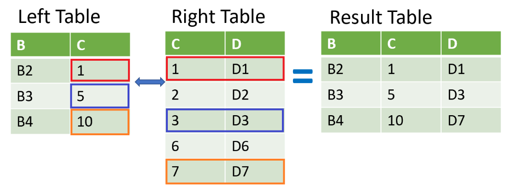

:PROPERTIES:
:ID:       c3f9e9e6-b7ed-45f0-86a5-35c8e84d96f9
:END:
#+title: Pandas Timeseries
#+filetags: :Pandas:

* [[id:a707e96d-102d-4549-8abe-ffeb9a8c3e9e][Pandas Datetime]]
* Time-series Merging
- ~merge_ordered~ is really useful for time-series data
#+begin_src python
pd.merge_ordered(df1, df2, on="date", fill_method="ffill")
gdp_sp500 = pd.merge_ordered(gdp, sp500, left_on="year", right_on="date",
                             how="left")
#+end_src
- ~merge_asof~
  - Similar to ~merge_ordered()~ left join
  - But it matches on the nearest key column and not exact numbers
#+begin_src python
pd.merge_asof(df1, df2, on="date",
              direction="nearest", # default "backward" is appropriate for stock data, it avoids look-ahead bias
              )
#+end_src
- ~direction="backward"~: For each row in the left dataframe, match the last row in the right dataframe where the key is less than or equal to the left key

