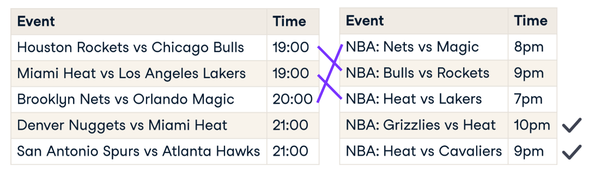

:PROPERTIES:
:ID:       67e8fd14-aa65-4037-8fc9-5ac6a9b0112b
:END:
#+title: Uniqueness Constraints
#+filetags: :Wrangling:
* How to Check?
#+begin_src python
# Get duplicate rows
duplicates = height.duplicated()
print(height[duplicates].head())

# Column names to check for duplication
column_names = ['first_name', 'last_name', 'address']
duplicates = height.duplicated(subset=column_names, keep=False)
# keep: whether to keep first or last, or all(False) duplicates

# Check duplicates
duplicates[duplicates].sort_values(by='first_name')
# no duplicates if duplicate_heights.empty is True
#+end_src

* How to deal with?
** Dropping Duplicates
- ~df.drop_duplicates()~, Options:
  - ~subset~ for columns
  - ~keep~: 'first', 'last', False
  - ~inplace~

** Replacing with Aggregation Value
#+begin_src python
column_names = ['first_name', 'last_name', 'address']
summaries = {'height': 'max'}
height = height.groupby(by=column_names).agg(summaries).reset_index()

# make sure aggregation is correct
duplicates = height.duplicated(subset=column_names, keep=False)
duplicate_heights = height[duplicates]

assert duplicate_heights.empty
# or
assert duplicate_heights.shape[0] == 0
#+end_src

** Fuzzy Duplicate Values

- No common unique identifier, ~join~ will not work
  - Use *Record Linkage*

*** Record Linkage
Record linkage is the act of linking data from different sources regarding the same entity.
[[file:images/screenshots/Fuzzy_Duplicate_Values/2024-12-04_11-04-25_screenshot.png]]
- Similar to [[Typo and Similar Strings]]
#+begin_src python
import recordlinkage as rl

# Generating pairs based on a matching column
# Create a indexing object
indexer = rl.Index() # the object we can use to generate pairs from df

# Generate pairs blocked on state
indexer.block(left_on='state', right_on='state')
pairs = indexer.index(df_A, df_B) # pandas multiIndex object containing all possible pairs

# Create a comparison object
compare_cl = rl.Compare()

# Find exact matches for pairs of date_of_birth and state
compare_cl.exact('date_of_birth', 'date_of_birth', label='date_of_birth')
compare_cl.exact('state', 'state', label='state')
# label lets us set the column name in the resulting dataframe

# Find similar matches for pairs of surname and address_1 using string similarity
compare_cl.string('surname', 'surname', threshold=0.85, label='surname')
compare_cl.string('address_1', 'address_1', threshold=0.85, label='address_1')

# Find matches
potential_matches = compare_cl.compute(pairs, df_A, df_B)
# Find the only pairs we want
matches = potential_matches[potential_matches.sum(axis=1) >= 2]

# Link the dataframes
# Get the indices of the duplicates in df_B
duplicates_rows_in_B = matches.index.get_level_values(1) # or by name
# Find new rows in df_B
df_B_new = df_B.loc[~df_B.index.isin(duplicates_rows_in_B)]

# Link df
df_full = df_A.append(df_B_new)
#+end_src
[[file:images/screenshots/Fuzzy_Duplicate_Values/2024-12-04_11-41-24_screenshot.png]]
