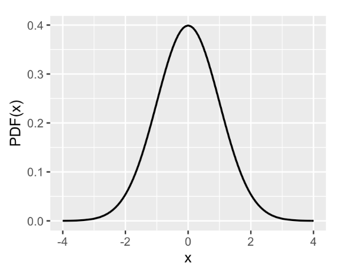

:PROPERTIES:
:ID:       e671c7ff-b03d-47a3-aa8a-91277e0e80c3
:END:
#+title: Z-Distribution
#+filetags: :Statistics:

* What is Z-Distribution?
- Z-Distribution(Standard normal distribution) is a special normal distribution where
  - the mean is 0
  - the standard deviation is 1

* Confidence Interval Bounds
| z-score(critical value) |  CI |
|-------------------------+-----|
| $\pm 1.96$                | 95% |
| $\pm 2.33$                | 98% |
- Margin of Error: $z\times SE$. it's half the width of the confidence interval.
  - e.g. for 95% CI: Margin of Error $= 1.96\times SE = 1.96\times\frac{\sigma}{\sqrt{n}}$
- $\bar{X_i}$ should be in $(\mu-1.96SE, \mu+1.96SE)$, then 95% Confidence Interval is:
  - $\bar{X_i}-1.96SE<\mu<\bar{X_i}+1.96SE$
  - 95% CI with the bigger sample size -> the smaller CI bounds

* $\alpha$ Levels
- $\alpha$ Levels of Likelihood.
- $\alpha$ level is a criterion for deciding whether or not something is likely or unlikely.
  - 5% (generally used)
  - 1%
  - 0.1%

* Critical Region
- For one-tailed test
  [[file:../assets/Statistics/CriticalRegionOneTailed.png]]
- For two-tailed test
  [[file:../assets/Statistics/CriticalRegionTwoTailed.png]]
